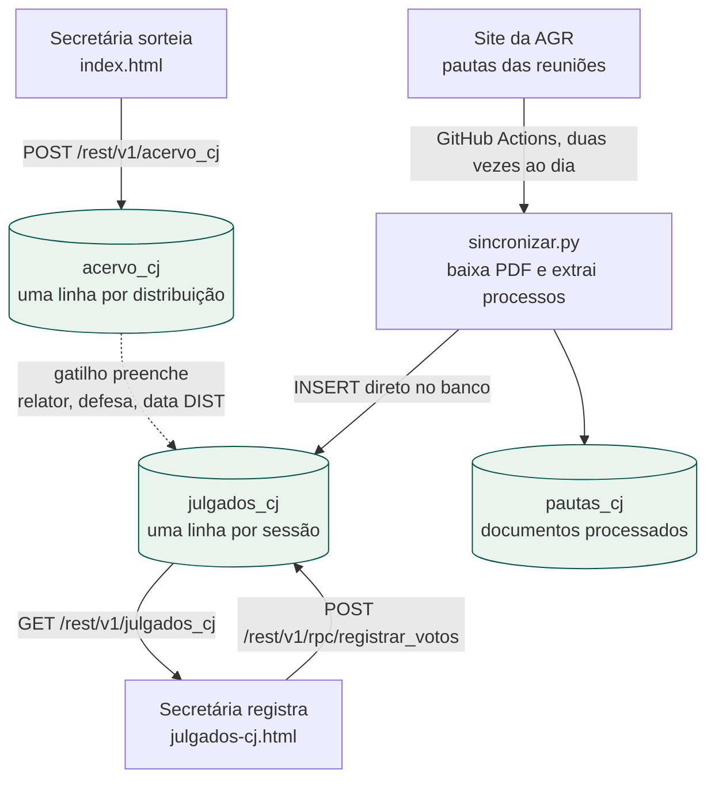
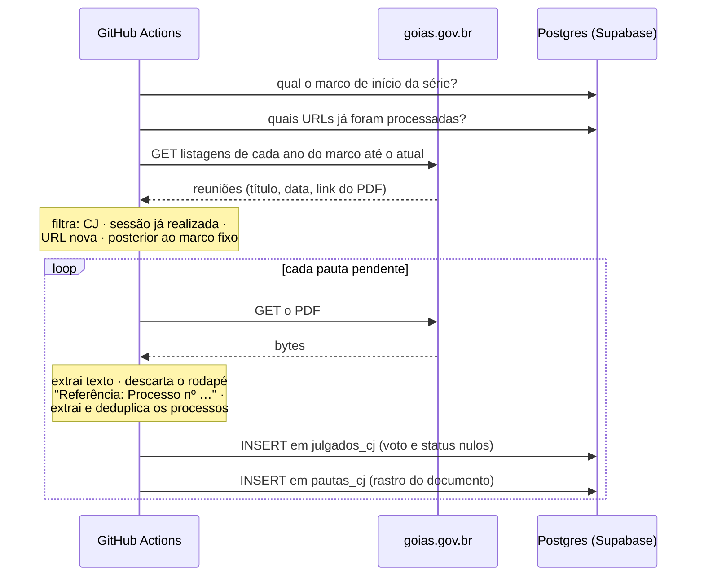
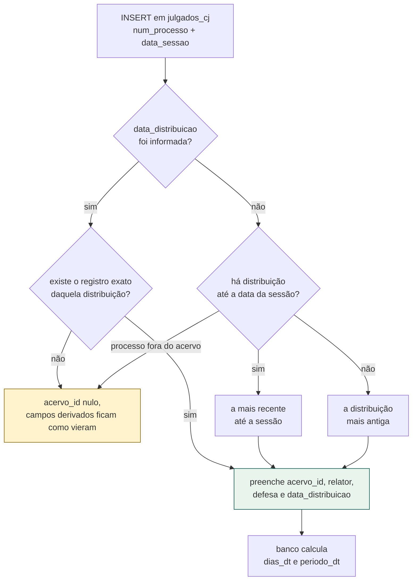
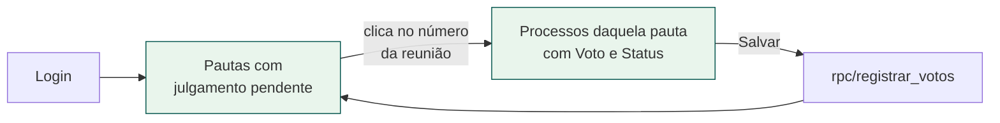
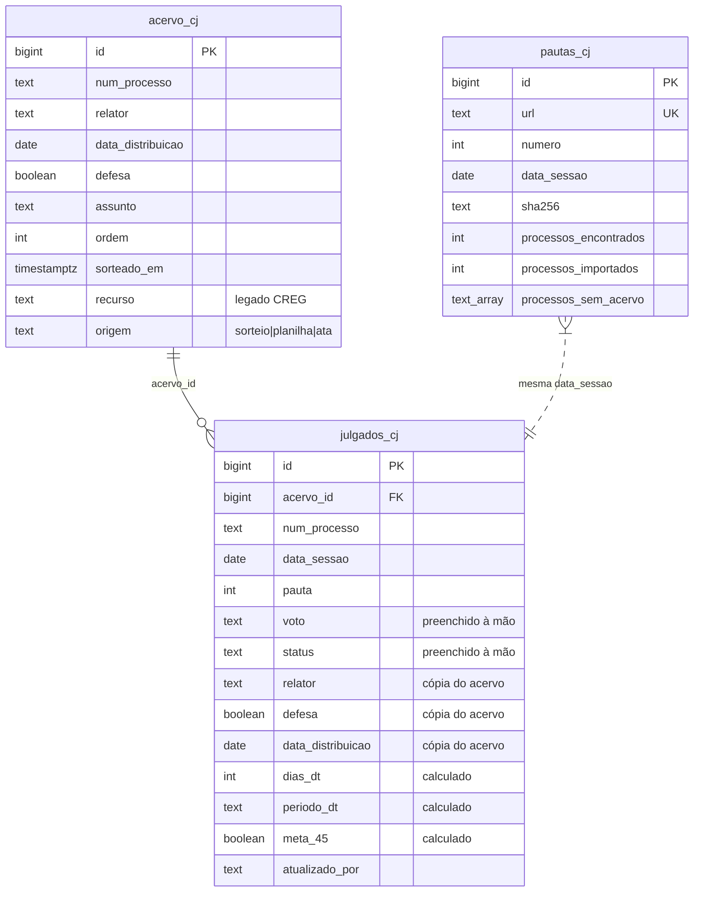

# Câmara de Julgamento — fluxo completo

Como um processo da Câmara de Julgamento (CJ) atravessa o sistema, do sorteio ao
julgamento registrado. Este documento é a referência de manutenção: o que cada
peça faz, por que foi feita assim, e onde estão as regras.

O Conselho Regulador (CREG) não está aqui — usou uma tabela de sorteio à parte
até 27/08/2026, quando ganhou o mesmo par de tabelas — ver
[FLUXO-CREG.md](FLUXO-CREG.md).

> **Reinício em 19/08/2026.** A série de julgados recomeçou nessa data: o
> histórico importado da planilha saiu das tabelas de produção e ficou guardado
> no schema `backup_cj`. Dois dias depois, uma carga de recuperação repôs o que
> a planilha não alcançava, lendo as atas de sorteio e as pautas publicadas. Ver
> *Reinício da série*, mais abaixo. Em 17/09/2026 uma segunda carga trouxe as
> atas de sorteio 015 e 016 — ver *A carga das atas 015 e 016*.
>
> **Histórico de volta em 18/09/2026.** O conteúdo de `backup_cj` foi mesclado
> de novo às tabelas de produção, somado à nova série: a CJ passou a ter acervo
> desde 06/2023 e julgados desde 01/2024, como o CREG. Ver *A mesclagem do
> histórico*.

---

## O ciclo em uma imagem



Três entradas de dados, e cada uma escreve em um lugar só:

| quem escreve | onde | como |
|---|---|---|
| `index.html` (sorteio) | `acervo_cj` | PostgREST, usuário autenticado |
| `sincronizar.py` (Actions) | `julgados_cj`, `pautas_cj` | conexão direta ao Postgres |
| `julgados-cj.html` (registro) | `julgados_cj` (só voto e status) | função `registrar_votos` |

---

## 1. Sorteio: o processo entra no acervo

A secretária abre [`index.html`](index.html), escolhe **Câmara de Julgamento** e
preenche uma linha por processo:

| campo na tela | vira em `acervo_cj` |
|---|---|
| Nº Processo | `num_processo` |
| Assunto (travado em "Auto de Infração") | `assunto` |
| **Defesa** (Sim/Não) | `defesa` (boolean) |
| — sorteado — cadeira CJ1..CJ5 | `relator` |
| — sorteado — data de hoje | `data_distribuicao` |
| ordem na tabela / hora do sorteio | `ordem`, `sorteado_em` |
| | `origem = 'sorteio'` |

Só ao apertar **Sortear CJ e Exportar** é que a linha vai para o banco — antes
disso não existe distribuição, porque `relator` e `data_distribuicao` só passam a
existir depois do sorteio.

> **Defesa, não Recurso.** No CREG a 6ª coluna registra o tipo de recurso. Na CJ
> ela registra se o autuado apresentou defesa (Sim/Não) — é esse dado que os
> julgados herdam. São perguntas diferentes e por isso a coluna muda de nome e de
> opções conforme o modo.

Se o Supabase estiver fora do ar, ou a sessão tiver expirado, o sorteio **não se
perde**: o sistema oferece um botão para baixar o `.json` de backup por um clique
explícito, sem depender da permissão de downloads automáticos do navegador.

### `acervo_cj` é uma linha por *distribuição*, não por processo

Esta é a decisão de modelagem mais importante do módulo. Um processo
redistribuído aparece mais de uma vez, com relator e data diferentes — que é
exatamente como a planilha da CJ sempre funcionou (3.205 linhas para 3.112
processos distintos).

```
num_processo      relator                    data_distribuicao   origem
202400029000262   Gilvan do Espírito Santo   2024-04-29          planilha
202400029000262   Paulo Henrique Marques     2025-11-05          planilha   ← redistribuído
```

A chave natural `(num_processo, data_distribuicao, relator)` é o que impede
duplicata quando um sorteio ou uma importação roda duas vezes. É também o índice
que a busca do processo usa.

---

## 2. Pauta: a AGR publica quem vai a julgamento

Toda semana a AGR publica em
`goias.gov.br/agr/pautas-das-reunioes-{ano}/` o PDF da pauta da reunião. O job do
GitHub Actions lê essa página e importa os processos.



### Por que roda no Actions e não no site

O site é estático no GitHub Pages. O navegador não consegue buscar
`goias.gov.br` (o portal não libera CORS), nem baixar e ler PDF de outro domínio.
Não existe servidor nosso, então o "endpoint" virou um job agendado — que ainda
tem a vantagem de deixar o log de cada rodada na aba Actions, coerente com a
proposta de auditoria do projeto.

Dispara sozinho duas vezes ao dia, antes das consultas das 12:00 e das 17:00 de
Goiás (cada janela com duas tentativas, porque o agendamento do Actions descarta
rodadas em pico — os motivos estão no próprio workflow), ou à mão em
**Actions → Sincronizar Julgados → Run workflow**, com opção de simular. A
mesma rodada sincroniza o Conselho Regulador.

Consequência prática: a pauta publicada de manhã só entra na rodada de 11:20.
Quem precisar dela antes dispara o workflow à mão — foi o que se fez com a 34ª
reunião em 17/09/2026.

### Como um processo é identificado no PDF

Número SEI de **15 dígitos precedido de `Processo nº`**. Conferido em 10 pautas
de datas diferentes: 190 números de 15 dígitos, 190 com o rótulo, e nenhum outro
número do documento chega perto — auto de infração tem 5 dígitos, código
verificador do SEI tem 8.

O rótulo tolera `nº`, `n°`, `no`, `n.` ou nada, com espaço ou quebra de linha no
meio.

### A regra crítica: o processo do rodapé

Todo PDF termina com algo como:

```
Referência: Processo nº 202600029000051 SEI 92118842
```

Esse é o processo **do próprio documento** no SEI, não um processo julgado. Ele
nunca pode entrar em `julgados_cj`.

A exclusão é **por contexto, nunca por lista de números proibidos** — o número
muda a cada ano. A extração é em duas etapas, de propósito, para ficar legível e
testável:

```
texto do PDF  →  apaga os trechos "Referência: Processo nº …"  →  procura os processos
```

E não o contrário, com um regex único cheio de lookbehind.

Se um dia aparecer um número de 15 dígitos **sem** o rótulo, a sincronização
registra o aviso em vez de perdê-lo em silêncio — é o sinal de que a AGR mudou o
formato e o parser precisa de revisão.

### Data da sessão

Vem de duas fontes independentes que são conferidas entre si:

1. a listagem HTML — `– 25/06/2026 às 09:00 horas`;
2. o corpo do PDF — `Data: 25/06/2026`.

Vale a listagem; divergência vira aviso no log. Nunca se usa a data em que o job
rodou.

> **Cuidado com o número interno do PDF.** O campo `PAUTA DE REUNIÃO - N` dentro
> do documento é o sequencial do tipo de documento no SEI, e diverge do número da
> reunião a partir da 26ª (26→29, 30→34). O que vai para `julgados_cj.pauta` é o
> número do **título da listagem**, que é o que bate com o histórico da planilha.

### O número da pauta não é chave — a data é

De 2026 em diante `julgados_cj.pauta` guarda o número da AGR, gravado pela
sincronização. O que segue vale para o histórico da planilha (até 18/06/2026),
e explica por que a data continua sendo a chave para agrupar:

| ano | numeração | confere com a AGR |
|---|---|---|
| 2024 | interna da Câmara | 43% dos números; **100% das datas** |
| 2025 | interna da Câmara | 41% dos números; **100% das datas** |
| 2026 em diante | da AGR (gravada pela sincronização) | 100% |

A numeração interna conta **pautas emitidas**; a da AGR conta **reuniões
realizadas e publicadas**. Uma sessão cancelada consome número de pauta e nunca
aparece na listagem — por isso 2025 não tem as pautas 26, 33, 39, 48, 49 nem 51,
e por isso o número interno corre à frente do oficial, com a diferença crescendo
ao longo do ano (até +3 em 2024 e +5 em 2025).

Renumerar o histórico para seguir a AGR reescreveria 1.678 das 3.146 linhas e 62
sessões de registro administrativo, trocando o número que a própria Câmara usou
pelo de outra contagem. A decisão foi **não renumerar**, e continuou valendo
quando o histórico voltou à produção em 18/09/2026.

Em consequência:

- **em relatório e consulta, agrupe sessões por `data_sessao`**, que confere com
  a listagem oficial em 100% das sessões dos três anos;
- a tela de registro mostra a **data como rótulo principal** do cartão, com o
  número da reunião abaixo, em segundo plano;
- a coluna tem um `comment` no banco avisando disso, visível no Table Editor do
  Supabase;
- se um dia o número oficial fizer falta para cruzar com o PDF, o caminho é uma
  coluna `pauta_agr` ao lado — os dois números são dois fatos distintos, e
  guardar ambos não destrói nada.

Duas duplicatas de 2025 ficam em aberto de propósito, porque consertá-las
exigiria adivinhar: a pauta **46** aparece em 09/10 e 21/10 (os números livres
seriam 48 ou 49, sem como decidir qual), e a **56** aparece em 04/12 e 09/12
(não há número livre entre 56 e 57). A transposição das pautas 13 e 14 de março,
essa sim, foi corrigida — ela era demonstrável sem recorrer à AGR, porque a
numeração andava para trás no tempo.

### Idempotência

Duas guardas que se cobrem:

- `pautas_cj.url` é único — o mesmo documento não é processado duas vezes;
- `julgados_cj (num_processo, data_sessao)` é único — o mesmo processo não entra
  duas vezes na mesma sessão.

A segunda também protege a época da planilha: reprocessar uma pauta antiga não
duplica nada.

O corte de data não avança com cada sucesso: ele é o marco fixo do início da
série. A rodada automática consulta cada ano entre o marco e o atual. Assim, um
PDF que falhou não é marcado e volta mesmo depois da virada do ano; uma
republicação da mesma sessão, com URL nova, também é processada.

---

## 3. A relação entre pauta e acervo

Quando um processo entra em `julgados_cj`, o banco vai sozinho buscá-lo em
`acervo_cj` e preenche o que dá para derivar. Quem faz isso é o gatilho
`julgados_cj_derivar_do_acervo`.



### De onde veio essa regra

A aba Julgados da planilha derivava três colunas do Acervo, e **as três fórmulas
discordavam entre si**:

| coluna | fórmula | de onde tirava |
|---|---|---|
| Relator | `INDEX(Acervo!B; MATCH(Processo; Acervo!A; 0))` | primeira distribuição |
| Defesa | idem, coluna D | primeira distribuição |
| Data DIST | `AGGREGATE(14;6; Acervo!C/(Acervo!A=Processo);1)` | **maior** data |

Em processo redistribuído isso produzia o relator de uma distribuição com a data
de outra. Somavam-se intervalos desatualizados (`$A$2:$A$946` numa fórmula,
`$A$1:$A$1944` em outra), que faziam a planilha acertar alguns casos por acaso.

No banco as três saem do **mesmo registro**, escolhido pela regra que preserva o
histórico: **a última distribuição ocorrida até a data da sessão** — o relator
que de fato levou o processo à mesa. Redistribuição posterior ao julgamento não
contamina o registro.

### Cópia, não referência

`relator`, `defesa` e `data_distribuicao` são **gravados** em `julgados_cj`,
não lidos por `JOIN` na hora da consulta. É deliberado: eles registram o estado
do processo **no momento do julgamento**. Se o processo for redistribuído depois,
o acervo muda e o julgamento já ocorrido continua contando a verdade daquele dia.

O `acervo_id` fica lá do lado para quem quiser navegar até a distribuição de
origem.

### Valor informado sempre vence

O gatilho só preenche o que vier nulo (`coalesce`). Isso importa porque a aba
Julgados tem 1.122 linhas com Defesa digitada à mão, e a importação do histórico
não podia sobrescrevê-las.

Para forçar a rederivação de um campo, basta gravar `null` nele.

### Colunas que o banco calcula sozinho

| coluna | fórmula da planilha | no banco |
|---|---|---|
| `dias_dt` | `=-I+D` | coluna gerada: `data_sessao - data_distribuicao` |
| `periodo_dt` | `IF` aninhado ano a ano | coluna gerada, trimestre calculado (`1T26`) |
| `meta_45` | — (só a planilha do CREG tinha) | coluna gerada: até 45 dias; nula quando falta a distribuição ou a sessão veio antes dela |

O `IF` da planilha parava em 2026; a versão calculada já funciona de 2027 em
diante sem manutenção.

### Processo que não está no acervo

Não é erro e não interrompe o resto. O julgado é gravado com `acervo_id` nulo e
sem os campos derivados — **sem inventar dado nenhum** — e o número sai listado
em `pautas_cj.processos_sem_acervo` para a secretaria completar o acervo. Na
planilha, o equivalente era a fórmula devolver "Não encontrado".

Hoje é raro: depois da carga das atas 015 e 016, em 17/09/2026, 245 dos 246
julgados de 2026 encontram a distribuição. O único que não encontra é o
`202600029001283`, da 25ª reunião, cuja distribuição não está em fonte nenhuma —
nem nas atas de sorteio 010 a 016, nem na planilha. Dele se sabe o relator,
porque a própria pauta o diz; a data da distribuição é que não existe em lugar
nenhum, e sem ela não há linha de acervo a criar.

### Completar o acervo depois não conserta o julgado sozinho

O gatilho dispara em `julgados_cj`, e só nela. Inserir em `acervo_cj` a
distribuição que faltava **não toca** no julgado órfão, então nada reexecuta: ele
continua com `acervo_id` nulo por mais que o processo já esteja no acervo. Vale
para o sorteio feito depois da sessão e para qualquer correção manual do acervo.

Quem fecha o ciclo é [`rederivar_cj.sql`](sql/rederivar_cj.sql), rodado no SQL Editor
do Supabase. Uma atribuição do campo a ele mesmo basta para disparar o gatilho,
que procura o processo outra vez e vincula o acervo que agora existe. Os valores
já revisados manualmente continuam vencendo os derivados:

```sql
update public.julgados_cj
   set data_distribuicao = data_distribuicao
 where acervo_id is null;
```

O filtro é o que torna a operação segura de repetir: ele só alcança linha sem
vínculo, nunca zera relator, defesa ou data já informados e, na segunda passada,
a linha vinculada não casa mais. **Voto e status não são
tocados** — o gatilho não encosta neles, e o que a secretaria preencheu na tela
continua lá.

É operação manual de propósito: não existe política de `UPDATE` em
`julgados_cj`, então nem o navegador nem a sincronização conseguem fazer isso.

---

## 4. Registro do voto e do status

A pauta é **convocação**: chega sem voto e sem status, porque as duas coisas são
decisão da sessão e só existem depois dela. Quem preenche é a secretaria, em
[`julgados-cj.html`](julgados-cj.html).



Pendente é quem tem **voto ou status** nulo. Os dois campos são independentes:
processo retirado de pauta fica com status e sem voto, e continua listado
enquanto faltar qualquer um dos dois.

### O cartão é uma pauta, não uma data

Cada cartão da primeira tela agrupa os pendentes por **`pauta` + `data_sessao`**,
não por data sozinha. A regra geral do projeto é agrupar sessões por
`data_sessao` (seção 2), e aqui a tela faz diferente de propósito: ela edita o
que a sincronização gravou, e o que a sincronização grava vem de **um documento
de pauta**, que tem número e data. O cartão espelha o documento.

Na prática os dois critérios dão o mesmo resultado. De 2026 em diante todas as
linhas de uma mesma data entram na mesma rodada da sincronização, com o número
que veio da listagem da AGR — não há como uma data ter dois números. Se um dia
houvesse, a tela mostraria dois cartões na mesma data, cada um com o seu número,
e o preenchimento continuaria correto: seriam dois documentos distintos.

Processo sem número de pauta (`pauta` nulo) forma o seu próprio cartão, rotulado
**“sem número de pauta”** — é o caso do histórico e de qualquer linha inserida à
mão.

Rótulos aceitos:

- **Voto**: `Manter`, `Anular`, `Vista`
- **Status**: `Julgado`, `Retornou`, `Retirado`, `Vista`

Eles existem em dois lugares — `julgados.js` e a função `registrar_votos`. Há um
teste que falha se divergirem, porque a divergência só apareceria em produção, na
hora de salvar.

Só as linhas em que a funcionária mexeu são enviadas. Linha intocada continua
pendente e reaparece na próxima vez.

---

## 5. Reinício da série (19/08/2026)

O histórico da planilha ia até 20/06/2026 e trazia junto as inconsistências de
três anos de digitação. A Câmara optou por recomeçar: guardar apenas os
processos ainda **não julgados** e registrar os julgamentos dali em diante pelo
próprio sistema.

```text
backup_cj.sql    →  copiou acervo_cj, julgados_cj e pautas_cj para o schema backup_cj
(limpeza)        →  zerou julgados_cj
                    tirou do acervo todo processo que aparecia em julgados_cj
                    gravou o marco de início da nova série
restaurar_cj.sql →  desfaz tudo e devolve o histórico
```

O script de limpeza era de execução única e saiu do repositório depois de
cumprir o papel; ele está no histórico do Git. O backup e a restauração ficam,
porque continuam valendo.

O que aconteceu, em números: o acervo foi de **3.199 para 37 distribuições** e
os julgados de **3.144 para 0**. As 37 que ficaram são de maio e junho de 2026 e
nunca passaram por uma sessão.

Antes de escrever o script, duas hipóteses de risco foram medidas e **as duas
deram zero**:

- nenhuma distribuição do acervo é posterior ao último julgamento do seu
  processo — não existe processo que tenha voltado e ainda espere sessão;
- o último julgamento de todos os 3.075 processos julgados tem status
  `Julgado`; nenhum parou em `Retornou`, `Retirado` ou `Vista`.

Por isso "processo já julgado" e "distribuição já julgada" davam o mesmo
resultado, e o script usa a regra simples.

### O marco de início

`pautas_cj` ganha uma linha com `url = 'marco:inicio-da-serie'`. Não é um
documento: é o corte fixo a partir do qual a sincronização procura toda URL
ainda não processada. Ele não avança quando uma pauta entra; por isso uma falha
antiga não fica escondida por uma sessão posterior. Sem o marco, a sincronização
usa a sessão mais recente apenas como compatibilidade com instalações antigas.

A data canônica é **18/06/2026**, a última sessão mantida no histórico antes da
nova série. Assim a sincronização sempre volta ao mesmo corte e encontra todas
as pautas posteriores, inclusive a carga de recuperação iniciada em 25/06.

Relatórios que contem documentos de pauta devem filtrar `url like 'https://%'`.

### A carga de recuperação (21/08/2026)

O reinício deixou um vão. A planilha parava em 10/06 (sorteios) e 20/06
(julgados), mas a Câmara seguiu se reunindo: sem o acervo daquele período, todo
julgado sincronizado entraria com `acervo_id` nulo e sem relator, defesa nem
data de distribuição.

Um script de execução única fechou o vão até 20/08/2026, com duas fontes
oficiais e um insert por tabela, na ordem que o gatilho exige — acervo primeiro,
senão não há de onde derivar:

| tabela | fonte | linhas |
|---|---|---|
| `acervo_cj` | atas de sorteio 011 a 014/2026 (SEI 202600029000052) | 157 distribuições |
| `julgados_cj` | pautas da 21ª à 30ª reunião, lidas pelo mesmo parser do job | 151 julgados |
| `pautas_cj` | as dez URLs, com título e sha256 | 10 documentos |

Como a limpeza do reinício, ele saiu do repositório depois de cumprir o papel.
O que fica é o que ele decidiu, porque isso vale para as próximas cargas.

#### Três coisas que a ata de sorteio não traz

- **Defesa** sai do relator. Em 2026 o lote de homologação de auto de infração
  vai todo para um único relator — é o que as próprias atas anunciam no
  cabeçalho — e é o lote que corre sem defesa. A planilha confirma a regra sem
  uma exceção nas 518 distribuições do ano: 365 linhas de Paulo Otoni Ribeiro,
  todas `false`; 153 dos demais, todas `true`. A ata 010/2026 fecha com a
  planilha nas 32 distribuições que as duas cobrem, relator por relator.

  A regra tem três exceções, e nenhuma é palpite: a pauta da 28ª reunião lista
  `202600029001899`, `202600029001961` e `202600029000516` sob o rótulo
  *"Processo sem defesas:"*, dentro de um bloco que não é o do Otoni. Documento
  oficial vence heurística, e as três entraram com `defesa = false`.
- **Voto e status** ficam nulos, pelo motivo de sempre: a pauta é convocação, e
  o resultado da sessão não está no documento.
- **Grafia do relator** é normalizada para a da planilha (`Belem` → `Belém`,
  `Sousa` → `Souza`, esta última um erro de digitação numa linha da ata 011).
  Não é cosmético: `relator` entra na chave única do acervo, e duas grafias
  virariam duas distribuições do mesmo processo.

#### A pauta confere o acervo

A pauta agrupa os processos por relator — *"a serem relatados pelo relator X:"*
— e isso é uma segunda fonte, independente da ata, para o mesmo fato. Cruzando
as duas: **150 dos 151 julgados batem**. A exceção é o `202600029002208`, que a
ata 013 sorteou para Paulo Henrique Oliveira Marques em 27/07 e a 28ª reunião
levou à mesa pela Lorena Patricia de Oliveira em 06/08.

Os dois documentos estão certos, cada um sobre o seu fato, e é por isso que o
banco guarda os dois separados: o acervo registra o **sorteio** e fica com a
ata; `julgados_cj.relator` registra **quem levou o processo à mesa** e fica com
a pauta. Como o gatilho só preenche o que vem nulo, informar o relator na linha
do julgado basta para ele vencer o derivado.

Não dá para transformar isso numa redistribuição no acervo sem inventar a data
em que ela teria acontecido — e é justamente o que a carga não fez.

#### A corrida com a sincronização

O job do Actions grava os julgados assim que a AGR publica a pauta. Foi o que
aconteceu com a 30ª reunião, na manhã de 21/08: ele rodou antes da carga e
gravou 17 julgados sem relator, sem defesa e sem `acervo_id`, porque o acervo do
período ainda não existia.

Só inserir não conserta isso — o `on conflict do nothing` pula essas linhas e
elas ficariam órfãs para sempre. É exatamente o caso da seção 3, e a carga
resolveu com o mesmo `update` de [`rederivar_cj.sql`](sql/rederivar_cj.sql),
restrito às sessões do período. Pela mesma razão, `processos_importados` e
`processos_sem_acervo` de `pautas_cj` foram recalculados a partir do estado real
da tabela: o documento da 30ª tinha 17 processos "fora do acervo" congelados, e
passou a ter zero.

**A lição, para a próxima carga:** depois de completar o acervo, rode sempre o
`rederivar_cj.sql`. Inserir distribuição não desperta o gatilho.

#### Onde isso deixou o banco

| | antes | depois |
|---|---|---|
| `acervo_cj` | 37 distribuições | **194** (37 residuais + 157 das atas) |
| `julgados_cj` | 17, todos órfãos | **151**, todos com relator e defesa |
| `pautas_cj` | o marco + 1 documento | o marco + **10** documentos |

Sobram **44 distribuições ainda sem julgamento** — 34 do sorteio de 14/08 e 10
de sorteios anteriores. As 37 residuais foram todas julgadas nas dez pautas.

O `verificacao_cj.sql` fecha sem nenhum `ERRO`. Na CJ, os dois casos em aberto
são *Julgado sem processo no acervo* (o `1283`) e *Relator divergente do acervo
vinculado* (o `2208`). A conferência também mantém como `AVISO` os números CREG
legados fora do padrão, até que uma fonte oficial permita corrigi-los.

### A carga das atas 015 e 016 (17/09/2026)

O acervo parou em 14/08, a ata 014. Os dois sorteios seguintes não passaram pela
tela, e a sincronização seguiu gravando as pautas: a 32ª (03/09) e a 33ª (10/09)
entraram com **35 julgados órfãos** — sem relator, defesa, data de distribuição
nem `acervo_id` —, todos listados em `pautas_cj.processos_sem_acervo`. Era o
vão da seção anterior se repetindo.

A carga foi feita pelas mesmas regras da de 21/08, direto no banco, num bloco só:

| ata | data | sem defesa (CJ1) | com defesa | total |
|---|---|---|---|---|
| 014 | 14/08/2026 | 22 | 12 | 34 — já estava; conferida linha a linha, ordem e cadeira |
| **015** | **24/08/2026** | **47** | **13** | **60** |
| **016** | **16/09/2026** | **20** | **12** | **32** |

- **Formato das linhas** igual ao da ata 014 no banco: `relator` com a cadeira
  (`CJ1`..`CJ5`, pelo `cadeiras_cj`), `ordem` da ata e `sorteado_em` nulo — a
  ata não traz a hora.
- **`origem = 'ata'`**, e não `'sorteio'`. A carga entrou primeiro como
  `'sorteio'`, copiando as linhas de 21/08, porque `acervo_cj` só aceitava
  `sorteio` e `planilha`. O efeito apareceu no mesmo dia: o **Histórico de
  sorteios** lista `origem = 'sorteio'` a partir do marco de 27/08 e passou a
  mostrar a ata 016 como rodada feita na tela. A migração `20260917123135`
  trouxe a opção `'ata'` do Conselho e reclassificou as seis rodadas vindas de
  ata — as quatro da carga de recuperação (011 a 014) e as duas desta. O
  histórico da Câmara voltou a ficar vazio, como deve até o primeiro sorteio
  pela tela.
- **Defesa pela cadeira**, a regra de *Três coisas que a ata de sorteio não
  traz*. Antes de gravar, as pautas da 32ª e da 33ª foram lidas: os 35 órfãos
  batem com a ata 015 relator por relator, e o rótulo *"Processos sem defesa:"*
  só aparece no bloco do Paulo Otoni Ribeiro. Nenhuma exceção desta vez.
- **Nenhum processo das duas atas** já estava no acervo — não há
  redistribuição nesta carga.
- **Depois do insert**, o `update` de [`rederivar_cj.sql`](sql/rederivar_cj.sql)
  religou os 35 órfãos, e `processos_sem_acervo` das duas pautas foi recalculado
  a partir de `julgados_cj`: as duas ficaram vazias.

Na mesma manhã a pauta da **34ª reunião (17/09)** já estava no ar e a rodada
agendada ainda não tinha passado; o workflow foi disparado à mão só para a CJ.
Os 23 processos dela entraram vinculados, e os blocos de relator da pauta
conferem com as atas 014 e 015.

| | antes | depois |
|---|---|---|
| `acervo_cj` | 194 distribuições (até 14/08) | **286** (até 16/09) |
| `julgados_cj` | 223, 36 órfãos | **246**, 1 órfão (o `1283`) |
| `pautas_cj` | o marco + 13 documentos | o marco + **14** (até a 34ª) |
| distribuições sem julgamento | — | **41** (CJ1 20, CJ3 6, CJ5 6, CJ2 5, CJ4 4) |

Os 23 da 34ª são a fila de voto e status da secretaria. As conferências de
[`verificacao_cj.sql`](sql/verificacao_cj.sql) fecham sem `ERRO`, com os mesmos
dois avisos de antes (o `1283` e o `2208`).

### A mesclagem do histórico (18/09/2026)

O reinício tirou o histórico da produção; a Câmara decidiu trazê-lo de volta
para ficar com a mesma profundidade do CREG, que tem dados desde 2023. A fonte
foi `backup_cj`, e não a planilha: o backup já é a planilha corrigida — sem as
6 distribuições e os 2 julgados duplicados, e com os 20 julgados de 28/05 a
20/06/2026 que a planilha tinha com data arrastada (um por dia) nas sessões
reais.

Não houve remapeamento. Medido antes: nenhum id do backup estava em uso, fora
as 37 distribuições residuais do reinício, que eram as mesmas linhas; nenhum
julgado repetia processo e sessão, porque o backup termina em 18/06 e a nova
série começa em 25/06; as sequências já estavam acima dos ids do backup. A
numeração das pautas emenda sem salto: 20ª em 18/06, 21ª em 25/06.

| script | papel |
|---|---|
| [`backup_pre_mesclagem_cj.sql`](sql/backup_pre_mesclagem_cj.sql) | copia as quatro tabelas da CJ e a definição de `resumo_acervo_cj` para `backup_cj_pre_mesclagem` |
| [`mesclar_historico_cj.sql`](sql/mesclar_historico_cj.sql) | insere o histórico com os ids originais, gatilho desligado |
| [`desfazer_mesclagem_cj.sql`](sql/desfazer_mesclagem_cj.sql) | tira só o que a mesclagem trouxe e devolve a função; a nova série fica |

- **Relator de 2026 virou cadeira** pelo de-para de `cadeiras_cj`, como na
  migração `20260824180000`: a distribuição pela data dela, o julgado pela data
  da sessão. **2023 a 2025 ficam pelo nome** — a composição daqueles anos não é
  conhecida. `cadeiras_cj` não foi alterada.
- **Gatilho desligado**, como no `restaurar_cj.sql`: os 13 relatores e 12 defesas
  digitados à mão na planilha voltaram como estavam.
- **Dez julgados antigos voltaram para a fila** da tela de registro — 7
  `Retirado` sem voto, 2 sem voto nem status, 1 `Vista` sem status, de 07/2024 a
  01/2025, todos julgados de novo numa sessão seguinte. A secretaria os preenche
  pela tela; `registrar_votos` aceita porque falta voto ou status.
- **Painel do acervo:** `resumo_acervo_cj` montava uma coluna para cada relator
  que já apareceu no acervo, e ganharia sete colunas zeradas com os nomes do
  histórico. A migração `20260918115004` passou a montar as colunas com as
  cadeiras vigentes mais quem tem processo parado. Os pendentes não mudaram: 41
  antes e depois (CJ1 20, CJ3 6, CJ5 6, CJ2 5, CJ4 4).

| | antes | depois |
|---|---|---|
| `acervo_cj` | 286 (20/05 → 16/09/2026) | **3.448** (25/06/2023 → 16/09/2026) |
| `julgados_cj` | 246 (25/06 → 17/09/2026) | **3.390** (04/01/2024 → 17/09/2026) |
| fila da secretaria | 0 | **10** (os históricos acima) |

Conferido depois da carga: nenhuma linha anterior mudou (comparação campo a
campo com `backup_cj_pre_mesclagem`), todas as 3.199 distribuições e 3.144
julgados do backup estão na produção com os mesmos valores, e o
`verificacao_cj.sql` fecha sem `ERRO`. Os avisos que o histórico trouxe já eram
conhecidos: as pautas 46 e 56 de 2025 em duas datas (e o recuo 47 → 46 que a
primeira causa), 1 sessão anterior à distribuição em 2024, e as divergências de
relator e defesa digitadas à mão.

**O que ainda separa a CJ do CREG:** o CREG tem julgados desde 05/01/2023; a CJ
desde 04/01/2024. A planilha da Câmara não tem sessão em 2023 — mas a AGR tem:
ver a conferência abaixo.

#### Conferência com a planilha e com a AGR (18/09/2026)

Só leitura; nada foi gravado. As 185 pautas da CJ publicadas de 2023 a 2026
foram lidas com o parser da sincronização e cruzadas sessão a sessão com
`julgados_cj`; a planilha foi cruzada linha a linha com as duas tabelas.

**Planilha → banco:** as 3.199 distribuições distintas estão no acervo com a
mesma defesa. Dos 3.146 julgados, 3.121 casam por processo e sessão, 2 são as
duplicatas e 23 são a data arrastada — todos da pauta 17, que o banco pôs em
28/05/2026, e a AGR confirma. Voto, status e relator batem em todos. As
diferenças restantes são as correções já descritas: 70 pautas da troca 13/14 de
março de 2025 e 32 datas de distribuição em que a planilha pegava a maior data,
posterior à sessão. Sobrava uma sem explicação: `202400029002394` em 18/07/2024
tinha Defesa "Não" na planilha e `true` no banco (as duas distribuições dele
dizem "Sim"). Corrigida para `false` no mesmo dia, porque a planilha é a base do
histórico — com isso, planilha e banco concordam em todos os julgados.

**AGR → banco, 2024 a 2026:** as 142 sessões conferem em data, uma a uma, sem
sessão sobrando de nenhum lado; 126 conferem também processo a processo. Das
aparições de processo, 3.379 de 3.408 estão no banco. O que diverge:

- **21 pautados que a planilha registrou só na sessão seguinte**, 16 deles na 39ª
  de 24/09/2024 (julgados em 03/10). A planilha anotava onde o processo foi
  decidido, não cada vez que foi à pauta. O julgamento está certo; falta só a
  passagem anterior.
- **2 números com o ano trocado no PDF**: `202300029000185` (04/04/2024) e
  `202300029004229` (14/11/2024). O banco tem `2024…` com distribuição no
  acervo; o `2023…` não existe em fonte nenhuma.
- **1 processo pautado que não está em lugar nenhum**: `202300029005392`, 13ª
  reunião de 26/03/2024 — nem no acervo, nem nos julgados.
- **7 julgados que nenhuma pauta traz** — 22/02/2024 (2), 11/03/2024,
  05/09/2024, 06/03/2025 (2) e 26/06/2025. Este último está no PDF, mas sem o
  rótulo `Processo nº`; os outros seis podem ter sido incluídos em mesa.

**2023:** a AGR publicou **43 pautas da CJ**, com 665 aparições de 650
processos, e o banco não tem nenhuma — só 4 desses processos estão no acervo.
**Decidido em 18/09/2026: não importar.** A planilha é a base principal do
histórico da Câmara, e o histórico da CJ começa onde ela começa; importar 2023
criaria cerca de 650 julgados sem voto, sem status e sem distribuição de
origem.

**Acervo sem julgado:** as 37 distribuições que a planilha tinha no acervo e
não nos julgados foram todas julgadas entre 25/06 e 23/07/2026, e cada julgado
está ligado à distribuição da planilha e consta da pauta da AGR da mesma data.
As 41 distribuições ainda sem julgado são todas de atas de 2026 e não aparecem
em pauta nenhuma até a 34ª reunião (17/09/2026) — entram pela sincronização
quando forem pautadas.

### Restaurar

Todo script desta seção é **um comando só** — um único bloco `do $$ … $$`. Não é
estilo: o SQL Editor do Supabase fala com o banco por um pooler em modo
transação, e comandos separados podem cair em conexões diferentes. Ali
`begin;…commit;` não segura nada e tabela temporária desaparece entre um comando
e outro. Num bloco único, ou tudo passa ou nada é gravado.

A lista de processos julgados que a limpeza usa sai de `backup_cj.julgados_cj`,
e não da tabela que ela mesma acabou de esvaziar — por isso o script pode ser
repetido, e termina o serviço mesmo se uma tentativa anterior parou no meio.

O `restaurar_cj.sql` devolve as três tabelas ao estado do backup. Dois detalhes
que fazem um restore ingênuo falhar, e por isso ele lista as colunas uma a uma:
as colunas `id` são `generated always as identity` e exigem
`overriding system value`; `dias_dt`, `periodo_dt` e `meta_45` são geradas e recusam
qualquer valor — o banco as recalcula. O gatilho é desligado durante a carga
para que os campos derivados voltem como estavam, e as sequências são
reposicionadas no fim.

---

## 6. A API

Não existe backend próprio. O Supabase **é** a API: PostgREST na frente do
Postgres, e as regras moram no banco.

| ação | chamada | quem faz |
|---|---|---|
| gravar sorteio CJ | `POST /rest/v1/acervo_cj` | `index.html` |
| listar pendentes | `GET /rest/v1/julgados_cj?…&or=(voto.is.null,status.is.null)` | `julgados-cj.html` |
| gravar voto e status | `POST /rest/v1/rpc/registrar_votos` | `julgados-cj.html` |
| importar pautas | conexão direta ao Postgres | GitHub Actions |

Toda chamada do navegador passa por `api()` em [`supabase.js`](assets/js/supabase.js), que
centraliza autenticação, renovação da sessão e tratamento de erro.

### Sessão

Os tokens de acesso e renovação vivem em `sessionStorage`, para navegar entre as
páginas sem pedir login de novo; fechar a aba encerra a sessão. Com **Lembrar-me
neste computador** marcado no login (padrão desmarcado), eles vão para o
`localStorage` e sobrevivem ao fechamento do navegador. Quando o token de acesso
vence, `api()` renova o par e repete a chamada uma vez — relendo antes o refresh
token do `localStorage`, que outra aba pode já ter rotacionado. A interface e o
trabalho em andamento permanecem abertos mesmo se a renovação falhar; já ao abrir
uma página, sessão recusada pelo servidor descarta os tokens e recarrega a página
no login. O projeto não limita a duração das sessões, então o refresh token de um
"Lembrar-me" segue válido depois de dias parado. O botão **Sair** revoga a sessão
atual no Supabase e apaga os tokens dos dois armazenamentos. Senha nunca é
armazenada.

### Segurança: cada tabela recebe o mínimo

| tabela | o navegador pode |
|---|---|
| `acervo_creg` | INSERT |
| `julgados_creg` | SELECT |
| `acervo_cj` | INSERT |
| `julgados_cj` | **SELECT** |
| `pautas_cj` | nada |

**Não existe política de `UPDATE` ou `DELETE` em tabela nenhuma** — há teste
varrendo `pg_policies` para garantir. A leitura de `julgados_cj` é a única porta
aberta, e existe porque a página de registro precisa listar os pendentes.

Gravar voto e status passa pela função `registrar_votos`, que é `SECURITY
DEFINER` com `search_path` fixo e:

- aceita **só** voto e status — nenhum outro campo se move;
- recusa rótulo fora da lista, `id` não numérico e item sem `id`;
- anota `atualizado_por` (e-mail do JWT) e `atualizado_em`;
- **não encosta no histórico da planilha**: linha já julgada com `atualizado_em`
  nulo é imutável por essa porta. Só é editável o que ainda está pendente ou o
  que a própria página gravou antes, para corrigir digitação.

A chave publicável fica visível no código — ela identifica o projeto, não
autoriza operações. Quem protege é a RLS somada ao login. Por isso é obrigatório
manter **desativado** o cadastro público em *Authentication → Providers → Email →
Enable sign ups*.

O job de sincronização nunca usa a chave do navegador: conecta direto ao Postgres
com a `SUPABASE_DB_URL`, guardada nos secrets do GitHub.

---

## 7. As tabelas



Chaves e índices que sustentam as regras:

| objeto | para quê |
|---|---|
| `acervo_creg_distribuicao_unica (num_processo, data_distribuicao, unidade)` | o mesmo sorteio CREG não é gravado duas vezes |
| `acervo_cj_distribuicao_unica (num_processo, data_distribuicao, relator)` | sorteio/importação repetidos não duplicam; é o índice da busca do processo |
| `julgados_cj_sessao_unica (num_processo, data_sessao)` | um processo não é julgado duas vezes na mesma sessão |
| `acervo_cj_num_processo_check` e `julgados_cj_num_processo_check` | número fora do padrão SEI (15 dígitos) é recusado pelo banco, e não só pelo navegador; o relator fica sem restrição de formato porque o histórico guarda nomes |
| `pautas_cj.url` único | o mesmo PDF não é processado duas vezes |
| `idx_julgados_cj_pendentes` (parcial) | a fila de trabalho da página de registro, do tamanho da fila e não da tabela |
| `idx_julgados_cj_acervo` | navegar do julgado até a distribuição de origem |

---

## 8. Arquivos

| arquivo | papel |
|---|---|
| [`sql/schema.sql`](sql/schema.sql) | tabelas, gatilho, função de registro, RLS — estado final do banco |
| [`sql/verificacao_cj.sql`](sql/verificacao_cj.sql) | conferências de consistência, só leitura |
| [`sql/rederivar_cj.sql`](sql/rederivar_cj.sql) | religa ao acervo os julgados que entraram sem ele |
| [`sql/backup_cj.sql`](sql/backup_cj.sql) | copia as três tabelas para o schema backup_cj |
| [`sql/restaurar_cj.sql`](sql/restaurar_cj.sql) | devolve o backup às tabelas de produção |
| [`dados/importar_planilha.py`](dados/importar_planilha.py) | converte a planilha histórica em SQL de importação |
| [`sincronizacao/agr.py`](sincronizacao/agr.py) | listagem e download, só do portal do Estado de Goiás |
| [`sincronizacao/pauta.py`](sincronizacao/pauta.py) | texto do PDF, data, processos, exclusão da Referência |
| [`sincronizacao/sincronizar.py`](sincronizacao/sincronizar.py) | orquestra, CLI, resumo JSON |
| [`index.html`](index.html) / [`assets/js/index.js`](assets/js/index.js) | sorteio |
| [`julgados-cj.html`](julgados-cj.html) / [`assets/js/julgados.js`](assets/js/julgados.js) | registro de voto e status |
| [`acervo-cj.html`](acervo-cj.html) / [`assets/js/acervo.js`](assets/js/acervo.js) | painel do acervo da Câmara |
| [`assets/js/supabase.js`](assets/js/supabase.js) | configuração, login e chamadas, compartilhados |
| [`assets/css/index.css`](assets/css/index.css) | o design das três páginas |
| `.github/workflows/sincronizar-julgados-cj.yml` | o agendamento |
| [`tests/`](tests/) | as três suítes: banco em container, parser da AGR e sorteio |

---

## 9. Tratamento de falhas

| situação | o que acontece |
|---|---|
| Supabase fora do ar durante o sorteio | oferece o botão para baixar o `.json`; nenhum sorteio se perde |
| sorteio repetido (mesmo processo, dia e cadeira) | banco recusa; mensagem clara e botão de backup aparece |
| token de acesso expirado | renova a sessão e repete a chamada; se não conseguir, mantém a tela aberta, mostra o erro e preserva o backup |
| site da AGR fora do ar | o job falha inteiro e tenta de novo na próxima rodada |
| um PDF indisponível ou inválido | só aquele documento falha; os outros seguem, e ele **não** é marcado como processado |
| PDF sem processos | vira erro do documento; não marca como processado |
| processo fora do acervo | grava sem os campos derivados e reporta |
| formato do PDF mudou | números de 15 dígitos sem rótulo saem como aviso no log |

Cada documento tem a sua transação: um PDF com problema não desfaz o que já
entrou nem impede o processamento dos demais.

---

## 10. O que ainda não está resolvido

Revisto depois da carga das atas 015 e 016, em 17/09/2026.

### Do sistema

- **Sorteio fora da tela abre vão no acervo.** As atas 011 a 016 foram todas
  lançadas depois, por carga. Enquanto a ata não entra, cada pauta sincronizada
  grava órfãos, e só o `rederivar_cj.sql` os religa. O banco não tem como saber
  que um sorteio aconteceu; quem sabe é a ata.
- **Um julgado sem distribuição.** O `202600029001283`, da 25ª reunião
  (16/07/2026), é o único dos 246 julgados da série sem vínculo com o
  acervo. Ele não está nas atas de sorteio 010 a 016 nem no histórico
  da planilha, que cobre tudo até 10/06 — a mesma data da ata 010, com as mesmas
  32 distribuições. Relator e defesa foram gravados no julgado, porque a pauta
  diz de quem é, mas `acervo_id` e `data_distribuicao` ficam nulos e o número
  segue listado em `pautas_cj.processos_sem_acervo` da 25ª reunião. Aparecendo o
  documento que registra a distribuição, basta inseri-la no acervo e rodar o
  [`rederivar_cj.sql`](sql/rederivar_cj.sql).
- **Um processo relatado por quem não o sorteou.** O `202600029002208`: ata 013
  para Paulo Henrique, 28ª reunião pela Lorena. Está registrado assim de
  propósito — ver *A pauta confere o acervo* — mas se a troca teve um documento,
  ela vira uma redistribuição no acervo e o caso fecha.
- **Cadeira × conselheiro — resolvido.** `acervo_cj.relator` guarda a **cadeira**
  (`CJ1`..`CJ5`), e quem ocupa cada uma sai de [`cadeiras_cj`](sql/schema.sql),
  uma tabela por período. As 345 linhas que traziam nome foram convertidas pela
  migração `20260824180000`.

  A cadeira é o valor canônico porque é estável: quando a composição da Câmara
  mudar, o processo distribuído em 2026 continua tendo sido da CJ3 daquele
  período, e o de-para resolve quem era. Guardar o nome na linha congelaria a
  pessoa e faria a troca de composição reescrever a história — por isso
  composição nova entra como **linha nova**, com `ate` fechando a anterior,
  nunca como UPDATE.

  Na tela a cadeira aparece com o nome no hover: nas pills de exclusão do
  sorteio e nas colunas do painel do acervo, via `title` e `aria-label`. O
  painel recebe cadeira e nome na mesma resposta de `resumo_acervo_cj`, então o
  front não repete o de-para; o sorteio tem a lista em `index.js`, e um teste
  falha se ela divergir da tabela.

  **Fronteira conhecida:** a conversão alcança quem está no de-para. O histórico
  de 2023 a 2025, de volta à produção desde 18/09/2026, tem conselheiros de
  composições anteriores sem cadeira conhecida — eles seguem pelo nome, porque
  inventar o número seria pior. O painel não mistura os dois: as colunas saem
  das cadeiras vigentes, e um nome só vira coluna se tiver processo parado.
  Quando a composição daqueles anos for conhecida, ela entra em `cadeiras_cj`
  como linhas com `desde`/`ate`, e um `update` igual ao da migração
  `20260824180000` troca os nomes pelas cadeiras.
- ~~**CREG** continua numa tabela de sorteio à parte.~~ Resolvido em
  27/08/2026: o Conselho ganhou `acervo_creg`, `julgados_creg` e `pautas_creg`,
  e o sorteio passou a gravar no acervo. A tabela antiga foi removida do schema
  em 02/09/2026, depois de o que ela guardava ser conferido em `acervo_creg`.
  Ver [FLUXO-CREG.md](FLUXO-CREG.md).

### Decidido e encerrado

- **O interessado saiu da Câmara de Julgamento** em 20/08/2026. Deixou de ser
  usado, e não havia motivo para guardar nome de pessoa num registro que
  ninguém consultava: some da tela da CJ, de `acervo_cj`, de `julgados_cj`, da
  página de julgados e das atas em Word — o `schema.sql` derruba a coluna de
  quem já existia. **No Conselho Regulador ele voltou** em 27/08/2026, agora
  como campo livre digitado na tela do sorteio: fica em
  `acervo_creg.interessado` (anulável, porque os sorteios antigos não têm o
  dado) e na ata do CREG.
- **Edição concorrente** não é preocupação: a secretaria é pequena e, se duas
  pessoas abrirem a mesma pauta, vale quem salvar por último.

### Do histórico, que hoje vive em `backup_cj`

Nada disso afeta a produção; fica registrado porque volta junto se alguém rodar
o `restaurar_cj.sql`.

- **Duas pautas duplicadas em 2025** (46 e 56). Corrigi-las exigiria inventar o
  número: para a 46 havia dois candidatos livres (48 e 49) e para a 56 nenhum.
- **Um julgado com sessão anterior à distribuição.** O processo tem uma única
  distribuição registrada e ela é posterior ao julgamento; a distribuição
  original nunca foi anotada em lugar nenhum.
- **A numeração da pauta de 2024 e 2025** não bate com a da AGR, pelo motivo
  explicado na seção 2. Decidiu-se não renumerar.

Encontrados e corrigidos antes do reinício, mantidos aqui como registro:

- **24 linhas com data errada**: linhas 3067–3090 da planilha, todas
  `pauta = 17`, com datas incrementando de dia em dia de 28/05 a 20/06/2026,
  incluindo sábados e domingos. Arrastão de célula no Excel; a 17ª reunião foi
  só em 28/05. É também a razão de a sincronização não confiar apenas em
  `max(data_sessao)` — `pautas_cj` registra cada documento pela URL.
- **33 julgados com sessão anterior à distribuição**, efeito da fórmula
  `AGGREGATE(…;1)` da planilha, que trazia a redistribuição posterior no lugar
  da distribuição vigente. Rederivados; sobrou o caso sem solução acima.
