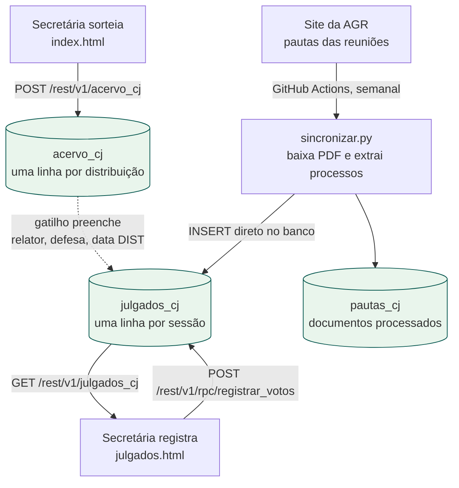
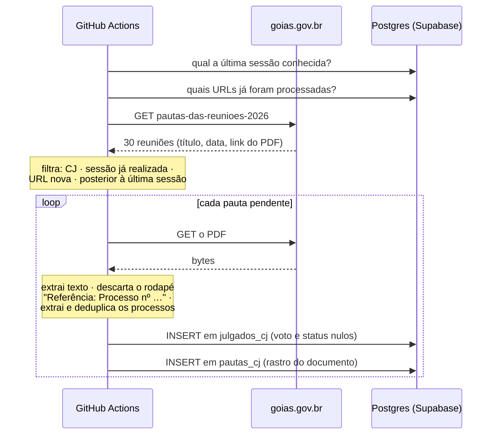
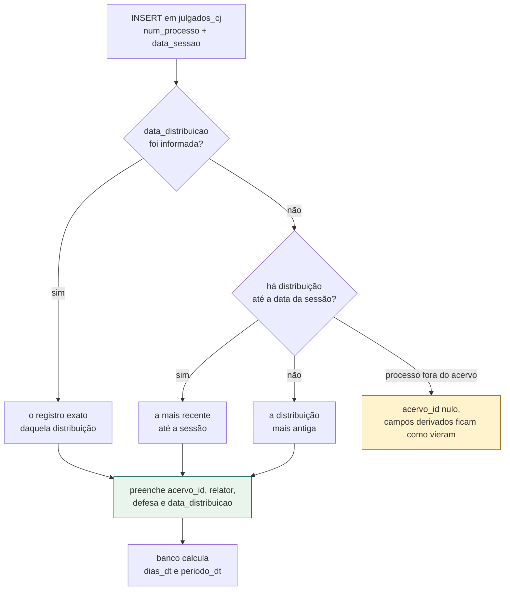
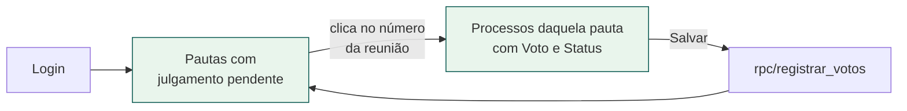
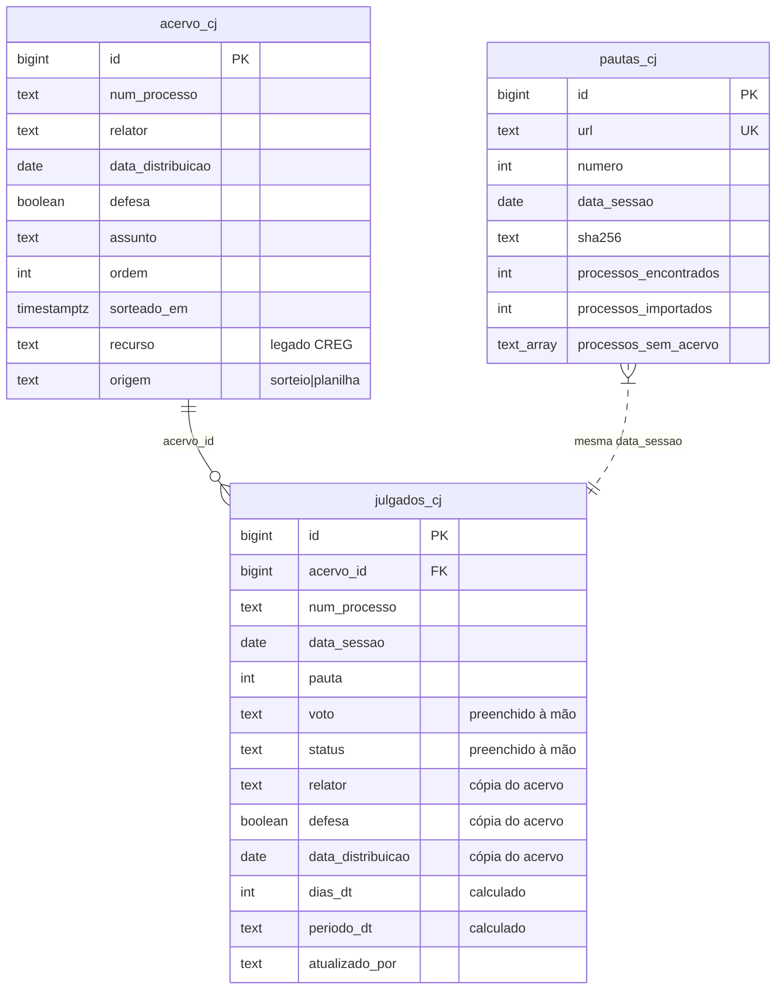

# Câmara de Julgamento — fluxo completo

Como um processo da Câmara de Julgamento (CJ) atravessa o sistema, do sorteio ao
julgamento registrado. Este documento é a referência de manutenção: o que cada
peça faz, por que foi feita assim, e onde estão as regras.

O Conselho Regulador (CREG) não está aqui — continua na tabela
`processos_sorteados` até ganhar o mesmo par de tabelas.

> **Reinício em 19/08/2026.** A série de julgados recomeçou nessa data: o
> histórico importado da planilha saiu das tabelas de produção e ficou guardado
> no schema `backup_cj`. Ver *Reinício da série*, mais abaixo.

---

## O ciclo em uma imagem



Três entradas de dados, e cada uma escreve em um lugar só:

| quem escreve | onde | como |
|---|---|---|
| `index.html` (sorteio) | `acervo_cj` | PostgREST, usuário autenticado |
| `sincronizar.py` (Actions) | `julgados_cj`, `pautas_cj` | conexão direta ao Postgres |
| `julgados.html` (registro) | `julgados_cj` (só voto e status) | função `registrar_votos` |

---

## 1. Sorteio: o processo entra no acervo

A secretária abre [`index.html`](index.html), escolhe **Câmara de Julgamento** e
preenche uma linha por processo:

| campo na tela | vira em `acervo_cj` |
|---|---|
| Nº Processo | `num_processo` |
| Assunto (travado em "Auto de Infração") | `assunto` |
| **Defesa** (Sim/Não) | `defesa` (boolean) |
| — sorteado — cadeira CJ1..CJ5 | `relator` |
| — sorteado — data de hoje | `data_distribuicao` |
| ordem na tabela / hora do sorteio | `ordem`, `sorteado_em` |
| | `origem = 'sorteio'` |

Só ao apertar **Sortear CJ e Exportar** é que a linha vai para o banco — antes
disso não existe distribuição, porque `relator` e `data_distribuicao` só passam a
existir depois do sorteio.

> **Defesa, não Recurso.** No CREG a 6ª coluna registra o tipo de recurso. Na CJ
> ela registra se o autuado apresentou defesa (Sim/Não) — é esse dado que os
> julgados herdam. São perguntas diferentes e por isso a coluna muda de nome e de
> opções conforme o modo.

Se o Supabase estiver fora do ar, ou a sessão tiver expirado, o sorteio **não se
perde**: o sistema baixa um `.json` de backup para reenvio posterior.

### `acervo_cj` é uma linha por *distribuição*, não por processo

Esta é a decisão de modelagem mais importante do módulo. Um processo
redistribuído aparece mais de uma vez, com relator e data diferentes — que é
exatamente como a planilha da CJ sempre funcionou (3.205 linhas para 3.112
processos distintos).

```
num_processo      relator                    data_distribuicao   origem
202400029000262   Gilvan do Espírito Santo   2024-04-29          planilha
202400029000262   Paulo Henrique Marques     2025-11-05          planilha   ← redistribuído
```

A chave natural `(num_processo, data_distribuicao, relator)` é o que impede
duplicata quando um sorteio ou uma importação roda duas vezes. É também o índice
que a busca do processo usa.

---

## 2. Pauta: a AGR publica quem vai a julgamento

Toda semana a AGR publica em
`goias.gov.br/agr/pautas-das-reunioes-{ano}/` o PDF da pauta da reunião. O job do
GitHub Actions lê essa página e importa os processos.



### Por que roda no Actions e não no site

O site é estático no GitHub Pages. O navegador não consegue buscar
`goias.gov.br` (o portal não libera CORS), nem baixar e ler PDF de outro domínio.
Não existe servidor nosso, então o "endpoint" virou um job agendado — que ainda
tem a vantagem de deixar o log de cada rodada na aba Actions, coerente com a
proposta de auditoria do projeto.

Dispara sozinho toda sexta de manhã (as sessões são às quintas) ou à mão em
**Actions → Sincronizar Julgados CJ → Run workflow**, com opção de simular.

### Como um processo é identificado no PDF

Número SEI de **15 dígitos precedido de `Processo nº`**. Conferido em 10 pautas
de datas diferentes: 190 números de 15 dígitos, 190 com o rótulo, e nenhum outro
número do documento chega perto — auto de infração tem 5 dígitos, código
verificador do SEI tem 8.

O rótulo tolera `nº`, `n°`, `no`, `n.` ou nada, com espaço ou quebra de linha no
meio.

### A regra crítica: o processo do rodapé

Todo PDF termina com algo como:

```
Referência: Processo nº 202600029000051 SEI 92118842
```

Esse é o processo **do próprio documento** no SEI, não um processo julgado. Ele
nunca pode entrar em `julgados_cj`.

A exclusão é **por contexto, nunca por lista de números proibidos** — o número
muda a cada ano. A extração é em duas etapas, de propósito, para ficar legível e
testável:

```
texto do PDF  →  apaga os trechos "Referência: Processo nº …"  →  procura os processos
```

E não o contrário, com um regex único cheio de lookbehind.

Se um dia aparecer um número de 15 dígitos **sem** o rótulo, a sincronização
registra o aviso em vez de perdê-lo em silêncio — é o sinal de que a AGR mudou o
formato e o parser precisa de revisão.

### Data da sessão

Vem de duas fontes independentes que são conferidas entre si:

1. a listagem HTML — `– 25/06/2026 às 09:00 horas`;
2. o corpo do PDF — `Data: 25/06/2026`.

Vale a listagem; divergência vira aviso no log. Nunca se usa a data em que o job
rodou.

> **Cuidado com o número interno do PDF.** O campo `PAUTA DE REUNIÃO - N` dentro
> do documento é o sequencial do tipo de documento no SEI, e diverge do número da
> reunião a partir da 26ª (26→29, 30→34). O que vai para `julgados_cj.pauta` é o
> número do **título da listagem**, que é o que bate com o histórico da planilha.

### O número da pauta não é chave — a data é

De 2026 em diante `julgados_cj.pauta` guarda o número da AGR, gravado pela
sincronização. O que segue vale para o histórico da planilha, hoje em
`backup_cj`, e explica por que a data continua sendo a chave para agrupar:

| ano | numeração | confere com a AGR |
|---|---|---|
| 2024 | interna da Câmara | 43% dos números; **100% das datas** |
| 2025 | interna da Câmara | 41% dos números; **100% das datas** |
| 2026 em diante | da AGR (gravada pela sincronização) | 100% |

A numeração interna conta **pautas emitidas**; a da AGR conta **reuniões
realizadas e publicadas**. Uma sessão cancelada consome número de pauta e nunca
aparece na listagem — por isso 2025 não tem as pautas 26, 33, 39, 48, 49 nem 51,
e por isso o número interno corre à frente do oficial, com a diferença crescendo
ao longo do ano (até +3 em 2024 e +5 em 2025).

Renumerar o histórico para seguir a AGR reescreveria 1.678 das 3.146 linhas e 62
sessões de registro administrativo, trocando o número que a própria Câmara usou
pelo de outra contagem. A decisão foi **não renumerar** — e, com o reinício da
série, esse histórico saiu das tabelas de produção de qualquer forma.

Em consequência:

- **em relatório e consulta, agrupe sessões por `data_sessao`**, que confere com
  a listagem oficial em 100% das sessões dos três anos;
- a tela de registro mostra a **data como rótulo principal** do cartão, com o
  número da reunião abaixo, em segundo plano;
- a coluna tem um `comment` no banco avisando disso, visível no Table Editor do
  Supabase;
- se um dia o número oficial fizer falta para cruzar com o PDF, o caminho é uma
  coluna `pauta_agr` ao lado — os dois números são dois fatos distintos, e
  guardar ambos não destrói nada.

Duas duplicatas de 2025 ficam em aberto de propósito, porque consertá-las
exigiria adivinhar: a pauta **46** aparece em 09/10 e 21/10 (os números livres
seriam 48 ou 49, sem como decidir qual), e a **56** aparece em 04/12 e 09/12
(não há número livre entre 56 e 57). A transposição das pautas 13 e 14 de março,
essa sim, foi corrigida — ela era demonstrável sem recorrer à AGR, porque a
numeração andava para trás no tempo.

### Idempotência

Duas guardas que se cobrem:

- `pautas_cj.url` é único — o mesmo documento não é processado duas vezes;
- `julgados_cj (num_processo, data_sessao)` é único — o mesmo processo não entra
  duas vezes na mesma sessão.

A segunda também protege a época da planilha: reprocessar uma pauta antiga não
duplica nada.

---

## 3. A relação entre pauta e acervo

Quando um processo entra em `julgados_cj`, o banco vai sozinho buscá-lo em
`acervo_cj` e preenche o que dá para derivar. Quem faz isso é o gatilho
`julgados_cj_derivar_do_acervo`.



### De onde veio essa regra

A aba Julgados da planilha derivava três colunas do Acervo, e **as três fórmulas
discordavam entre si**:

| coluna | fórmula | de onde tirava |
|---|---|---|
| Relator | `INDEX(Acervo!B; MATCH(Processo; Acervo!A; 0))` | primeira distribuição |
| Defesa | idem, coluna D | primeira distribuição |
| Data DIST | `AGGREGATE(14;6; Acervo!C/(Acervo!A=Processo);1)` | **maior** data |

Em processo redistribuído isso produzia o relator de uma distribuição com a data
de outra. Somavam-se intervalos desatualizados (`$A$2:$A$946` numa fórmula,
`$A$1:$A$1944` em outra), que faziam a planilha acertar alguns casos por acaso.

No banco as três saem do **mesmo registro**, escolhido pela regra que preserva o
histórico: **a última distribuição ocorrida até a data da sessão** — o relator
que de fato levou o processo à mesa. Redistribuição posterior ao julgamento não
contamina o registro.

### Cópia, não referência

`relator`, `defesa` e `data_distribuicao` são **gravados** em `julgados_cj`,
não lidos por `JOIN` na hora da consulta. É deliberado: eles registram o estado
do processo **no momento do julgamento**. Se o processo for redistribuído depois,
o acervo muda e o julgamento já ocorrido continua contando a verdade daquele dia.

O `acervo_id` fica lá do lado para quem quiser navegar até a distribuição de
origem.

### Valor informado sempre vence

O gatilho só preenche o que vier nulo (`coalesce`). Isso importa porque a aba
Julgados tem 1.122 linhas com Defesa digitada à mão, e a importação do histórico
não podia sobrescrevê-las.

Para forçar a rederivação de um campo, basta gravar `null` nele.

### Colunas que o banco calcula sozinho

| coluna | fórmula da planilha | no banco |
|---|---|---|
| `dias_dt` | `=-I+D` | coluna gerada: `data_sessao - data_distribuicao` |
| `periodo_dt` | `IF` aninhado ano a ano | coluna gerada, trimestre calculado (`1T26`) |

O `IF` da planilha parava em 2026; a versão calculada já funciona de 2027 em
diante sem manutenção.

### Processo que não está no acervo

Não é erro e não interrompe o resto. O julgado é gravado com `acervo_id` nulo e
sem os campos derivados — **sem inventar dado nenhum** — e o número sai listado
em `pautas_cj.processos_sem_acervo` para a secretaria completar o acervo. Na
planilha, o equivalente era a fórmula devolver "Não encontrado".

Isso é comum hoje: o acervo importado da planilha para no começo de julho de
2026, então processos julgados depois disso ainda não têm distribuição
registrada. Some conforme a CJ passar a sortear pelo sistema.

### Completar o acervo depois não conserta o julgado sozinho

O gatilho dispara em `julgados_cj`, e só nela. Inserir em `acervo_cj` a
distribuição que faltava **não toca** no julgado órfão, então nada reexecuta: ele
continua com `acervo_id` nulo por mais que o processo já esteja no acervo. Vale
para o sorteio feito depois da sessão e para qualquer correção manual do acervo.

Quem fecha o ciclo é [`rederivar_cj.sql`](sql/rederivar_cj.sql), rodado no SQL Editor
do Supabase. Gravar `null` num campo derivado é o pedido de rederivação — o
gatilho só preenche o que vem nulo — então zerar os três faz o banco procurar o
processo outra vez e vincular o que agora existe:

```sql
update public.julgados_cj
   set relator = null, defesa = null, data_distribuicao = null
 where acervo_id is null;
```

O filtro é o que torna a operação segura de repetir: ele só alcança linha que já
está vazia, nunca sobrescreve o relator de um julgamento que já aconteceu, e na
segunda passada a linha vinculada não casa mais. **Voto e status não são
tocados** — o gatilho não encosta neles, e o que a secretaria preencheu na tela
continua lá.

É operação manual de propósito: não existe política de `UPDATE` em
`julgados_cj`, então nem o navegador nem a sincronização conseguem fazer isso.

---

## 4. Registro do voto e do status

A pauta é **convocação**: chega sem voto e sem status, porque as duas coisas são
decisão da sessão e só existem depois dela. Quem preenche é a secretaria, em
[`julgados.html`](julgados.html).



Pendente é quem tem **voto ou status** nulo. Os dois campos são independentes:
processo retirado de pauta fica com status e sem voto, e continua listado
enquanto faltar qualquer um dos dois.

### O cartão é uma pauta, não uma data

Cada cartão da primeira tela agrupa os pendentes por **`pauta` + `data_sessao`**,
não por data sozinha. A regra geral do projeto é agrupar sessões por
`data_sessao` (seção 2), e aqui a tela faz diferente de propósito: ela edita o
que a sincronização gravou, e o que a sincronização grava vem de **um documento
de pauta**, que tem número e data. O cartão espelha o documento.

Na prática os dois critérios dão o mesmo resultado. De 2026 em diante todas as
linhas de uma mesma data entram na mesma rodada da sincronização, com o número
que veio da listagem da AGR — não há como uma data ter dois números. Se um dia
houvesse, a tela mostraria dois cartões na mesma data, cada um com o seu número,
e o preenchimento continuaria correto: seriam dois documentos distintos.

Processo sem número de pauta (`pauta` nulo) forma o seu próprio cartão, rotulado
**“sem número de pauta”** — é o caso do histórico e de qualquer linha inserida à
mão.

Rótulos aceitos:

- **Voto**: `Manter`, `Anular`, `Vista`
- **Status**: `Julgado`, `Retornou`, `Retirado`, `Vista`

Eles existem em dois lugares — `julgados.js` e a função `registrar_votos`. Há um
teste que falha se divergirem, porque a divergência só apareceria em produção, na
hora de salvar.

Só as linhas em que a funcionária mexeu são enviadas. Linha intocada continua
pendente e reaparece na próxima vez.

---

## 5. Reinício da série (19/08/2026)

O histórico da planilha ia até 20/06/2026 e trazia junto as inconsistências de
três anos de digitação. A Câmara optou por recomeçar: guardar apenas os
processos ainda **não julgados** e registrar os julgamentos dali em diante pelo
próprio sistema.

```text
backup_cj.sql    →  copiou acervo_cj, julgados_cj e pautas_cj para o schema backup_cj
(limpeza)        →  zerou julgados_cj
                    tirou do acervo todo processo que aparecia em julgados_cj
                    gravou o marco de início da nova série
restaurar_cj.sql →  desfaz tudo e devolve o histórico
```

O script de limpeza era de execução única e saiu do repositório depois de
cumprir o papel; ele está no histórico do Git. O backup e a restauração ficam,
porque continuam valendo.

O que aconteceu, em números: o acervo foi de **3.199 para 37 distribuições** e
os julgados de **3.144 para 0**. As 37 que ficaram são de maio e junho de 2026 e
nunca passaram por uma sessão.

Antes de escrever o script, duas hipóteses de risco foram medidas e **as duas
deram zero**:

- nenhuma distribuição do acervo é posterior ao último julgamento do seu
  processo — não existe processo que tenha voltado e ainda espere sessão;
- o último julgamento de todos os 3.075 processos julgados tem status
  `Julgado`; nenhum parou em `Retornou`, `Retirado` ou `Vista`.

Por isso "processo já julgado" e "distribuição já julgada" davam o mesmo
resultado, e o script usa a regra simples.

### O marco de início

`pautas_cj` ganha uma linha com `url = 'marco:inicio-da-serie'`. Não é um
documento: é como a sincronização sabe a partir de quando começar. Ela processa
as sessões **posteriores** à sessão mais recente que o banco conhece — e com
`julgados_cj` vazia, sem esse marco, reimportaria o ano inteiro.

A data é o dia anterior a hoje no fuso de Goiás, para que uma sessão de hoje
ainda entre. O fuso é explícito porque o banco roda em UTC e, à noite, o
`current_date` de lá já é o dia seguinte aqui.

Relatórios que contem documentos de pauta devem filtrar `url like 'https://%'`.

### O acervo fica vazio por um tempo

Consequência direta e esperada: os processos que vierem nas próximas pautas não
estarão no acervo, então entrarão com `acervo_id` nulo e sem relator, defesa nem
data de distribuição. Isso se resolve conforme a Câmara passar a sortear pelo
sistema — cada sorteio alimenta o acervo, e os julgados seguintes já encontram
o processo.

### Restaurar

Os três scripts são **um comando só cada** — um único bloco `do $$ … $$`. Não é
estilo: o SQL Editor do Supabase fala com o banco por um pooler em modo
transação, e comandos separados podem cair em conexões diferentes. Ali
`begin;…commit;` não segura nada e tabela temporária desaparece entre um comando
e outro. Num bloco único, ou tudo passa ou nada é gravado.

A lista de processos julgados que a limpeza usa sai de `backup_cj.julgados_cj`,
e não da tabela que ela mesma acabou de esvaziar — por isso o script pode ser
repetido, e termina o serviço mesmo se uma tentativa anterior parou no meio.

O `restaurar_cj.sql` devolve as três tabelas ao estado do backup. Dois detalhes
que fazem um restore ingênuo falhar, e por isso ele lista as colunas uma a uma:
as colunas `id` são `generated always as identity` e exigem
`overriding system value`; `dias_dt` e `periodo_dt` são geradas e recusam
qualquer valor — o banco as recalcula. O gatilho é desligado durante a carga
para que os campos derivados voltem como estavam, e as sequências são
reposicionadas no fim.

---

## 6. A API

Não existe backend próprio. O Supabase **é** a API: PostgREST na frente do
Postgres, e as regras moram no banco.

| ação | chamada | quem faz |
|---|---|---|
| gravar sorteio CJ | `POST /rest/v1/acervo_cj` | `index.html` |
| listar pendentes | `GET /rest/v1/julgados_cj?…&or=(voto.is.null,status.is.null)` | `julgados.html` |
| gravar voto e status | `POST /rest/v1/rpc/registrar_votos` | `julgados.html` |
| importar pautas | conexão direta ao Postgres | GitHub Actions |

Toda chamada do navegador passa por `api()` em [`supabase.js`](assets/js/supabase.js), que
centraliza autenticação, tratamento de erro e o retorno à tela de login quando a
sessão expira.

### Sessão

O token de acesso vive em `sessionStorage`, para navegar entre as duas páginas
sem pedir login de novo. Expira em cerca de uma hora; quando isso acontece,
qualquer chamada devolve 401 e o `api()` recoloca a tela de login com a mensagem
certa. Senha nunca é armazenada.

### Segurança: cada tabela recebe o mínimo

| tabela | o navegador pode |
|---|---|
| `processos_sorteados` | INSERT |
| `acervo_cj` | INSERT |
| `julgados_cj` | **SELECT** |
| `pautas_cj` | nada |

**Não existe política de `UPDATE` ou `DELETE` em tabela nenhuma** — há teste
varrendo `pg_policies` para garantir. A leitura de `julgados_cj` é a única porta
aberta, e existe porque a página de registro precisa listar os pendentes.

Gravar voto e status passa pela função `registrar_votos`, que é `SECURITY
DEFINER` com `search_path` fixo e:

- aceita **só** voto e status — nenhum outro campo se move;
- recusa rótulo fora da lista, `id` não numérico e item sem `id`;
- anota `atualizado_por` (e-mail do JWT) e `atualizado_em`;
- **não encosta no histórico da planilha**: linha já julgada com `atualizado_em`
  nulo é imutável por essa porta. Só é editável o que ainda está pendente ou o
  que a própria página gravou antes, para corrigir digitação.

A chave publicável fica visível no código — ela identifica o projeto, não
autoriza operações. Quem protege é a RLS somada ao login. Por isso é obrigatório
manter **desativado** o cadastro público em *Authentication → Providers → Email →
Enable sign ups*.

O job de sincronização nunca usa a chave do navegador: conecta direto ao Postgres
com a `SUPABASE_DB_URL`, guardada nos secrets do GitHub.

---

## 7. As tabelas



Chaves e índices que sustentam as regras:

| objeto | para quê |
|---|---|
| `acervo_cj_distribuicao_unica (num_processo, data_distribuicao, relator)` | sorteio/importação repetidos não duplicam; é o índice da busca do processo |
| `julgados_cj_sessao_unica (num_processo, data_sessao)` | um processo não é julgado duas vezes na mesma sessão |
| `pautas_cj.url` único | o mesmo PDF não é processado duas vezes |
| `idx_julgados_cj_pendentes` (parcial) | a fila de trabalho da página de registro, do tamanho da fila e não da tabela |
| `idx_julgados_cj_acervo` | navegar do julgado até a distribuição de origem |

---

## 8. Arquivos

| arquivo | papel |
|---|---|
| [`sql/schema.sql`](sql/schema.sql) | tabelas, gatilho, função de registro, RLS — estado final do banco |
| [`sql/verificacao_cj.sql`](sql/verificacao_cj.sql) | conferências de consistência, só leitura |
| [`sql/rederivar_cj.sql`](sql/rederivar_cj.sql) | religa ao acervo os julgados que entraram sem ele |
| [`sql/backup_cj.sql`](sql/backup_cj.sql) | copia as três tabelas para o schema backup_cj |
| [`sql/restaurar_cj.sql`](sql/restaurar_cj.sql) | devolve o backup às tabelas de produção |
| [`dados/importar_planilha.py`](dados/importar_planilha.py) | converte a planilha histórica em SQL de importação |
| [`sincronizacao/agr.py`](sincronizacao/agr.py) | listagem e download, só do portal do Estado de Goiás |
| [`sincronizacao/pauta.py`](sincronizacao/pauta.py) | texto do PDF, data, processos, exclusão da Referência |
| [`sincronizacao/sincronizar.py`](sincronizacao/sincronizar.py) | orquestra, CLI, resumo JSON |
| [`index.html`](index.html) / [`assets/js/index.js`](assets/js/index.js) | sorteio |
| [`julgados.html`](julgados.html) / [`assets/js/julgados.js`](assets/js/julgados.js) | registro de voto e status |
| [`assets/js/supabase.js`](assets/js/supabase.js) | configuração, login e chamadas, compartilhados |
| [`assets/css/index.css`](assets/css/index.css) | o design das três páginas |
| `.github/workflows/sincronizar-julgados-cj.yml` | o agendamento |
| [`tests/`](tests/) | as três suítes: banco em container, parser da AGR e sorteio |

---

## 9. Tratamento de falhas

| situação | o que acontece |
|---|---|
| Supabase fora do ar durante o sorteio | baixa `.json` de backup; nenhum sorteio se perde |
| sorteio repetido (mesmo processo, dia e cadeira) | banco recusa; mensagem clara e backup baixado |
| sessão expirada | tela de login volta com a mensagem; o que estava para gravar vira backup |
| site da AGR fora do ar | o job falha inteiro e tenta de novo na próxima rodada |
| um PDF indisponível ou inválido | só aquele documento falha; os outros seguem, e ele **não** é marcado como processado |
| PDF sem processos | vira erro do documento; não marca como processado |
| processo fora do acervo | grava sem os campos derivados e reporta |
| formato do PDF mudou | números de 15 dígitos sem rótulo saem como aviso no log |

Cada documento tem a sua transação: um PDF com problema não desfaz o que já
entrou nem impede o processamento dos demais.

---

## 10. O que ainda não está resolvido

Revisto depois do reinício da série, em 20/08/2026.

### Do sistema

- **O acervo está em reconstrução.** Sobraram 37 distribuições, e nenhuma
  corresponde aos processos que virão nas próximas pautas. Até a Câmara passar a
  sortear pelo sistema, todo julgado sincronizado entra com `acervo_id` nulo e
  sem relator, defesa nem data de distribuição. Não é defeito: é o preço do
  recomeço. Daqui em diante o sorteio que vem **antes** da sessão já resolve
  sozinho; o julgado que entrou **antes** do sorteio precisa de um
  [`rederivar_cj.sql`](sql/rederivar_cj.sql) depois — o gatilho não dispara sozinho
  quando o acervo é completado (ver seção 3).
- **Cadeira × conselheiro.** As 37 linhas que sobraram vieram da planilha e
  trazem o **nome** do conselheiro em `relator`; tudo o que o sorteio gravar dali
  em diante traz a **cadeira** (`CJ1`..`CJ5`). Não existe de-para entre os dois,
  então relatório que cruze as duas origens não fecha. Resolver isso é uma
  tabela pequena ligando cadeira e conselheiro por período.
- **CREG** continua em `processos_sorteados`. Fica para depois; a estrutura
  está pronta para ganhar `acervo_creg` e `julgados_creg` com a mesma lógica.

### Decidido e encerrado

- **O interessado saiu do sistema** em 20/08/2026. Deixou de ser usado, e não
  havia motivo para guardar nome de pessoa num registro que ninguém consultava:
  some da tela dos dois modos, das três tabelas, da página de julgados e das
  atas em Word. O `schema.sql` derruba a coluna de quem já existia.
- **Edição concorrente** não é preocupação: a secretaria é pequena e, se duas
  pessoas abrirem a mesma pauta, vale quem salvar por último.

### Do histórico, que hoje vive em `backup_cj`

Nada disso afeta a produção; fica registrado porque volta junto se alguém rodar
o `restaurar_cj.sql`.

- **Duas pautas duplicadas em 2025** (46 e 56). Corrigi-las exigiria inventar o
  número: para a 46 havia dois candidatos livres (48 e 49) e para a 56 nenhum.
- **Um julgado com sessão anterior à distribuição.** O processo tem uma única
  distribuição registrada e ela é posterior ao julgamento; a distribuição
  original nunca foi anotada em lugar nenhum.
- **A numeração da pauta de 2024 e 2025** não bate com a da AGR, pelo motivo
  explicado na seção 2. Decidiu-se não renumerar.

Encontrados e corrigidos antes do reinício, mantidos aqui como registro:

- **24 linhas com data errada**: linhas 3067–3090 da planilha, todas
  `pauta = 17`, com datas incrementando de dia em dia de 28/05 a 20/06/2026,
  incluindo sábados e domingos. Arrastão de célula no Excel; a 17ª reunião foi
  só em 28/05. É também a razão de a sincronização não confiar apenas em
  `max(data_sessao)` — `pautas_cj` registra cada documento pela URL.
- **33 julgados com sessão anterior à distribuição**, efeito da fórmula
  `AGGREGATE(…;1)` da planilha, que trazia a redistribuição posterior no lugar
  da distribuição vigente. Rederivados; sobrou o caso sem solução acima.
