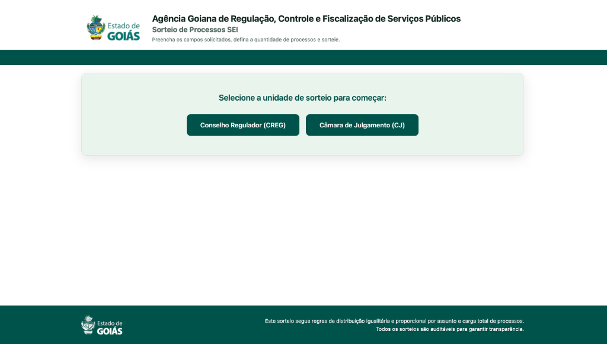
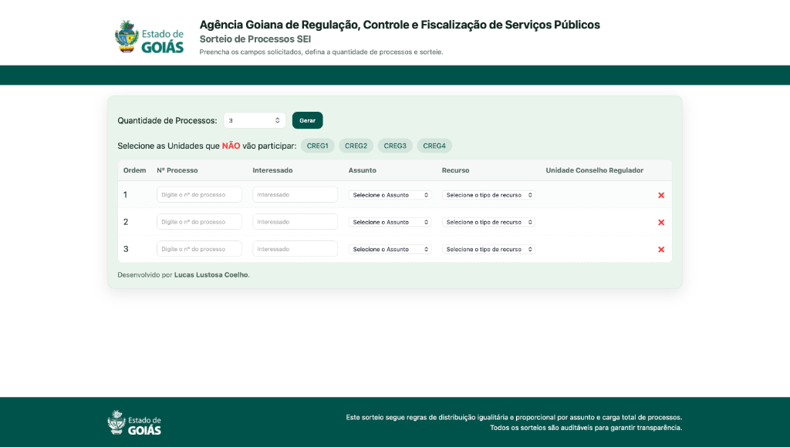

# Sorteador de Processos SEI

Aplicação web estática desenvolvida para auxiliar o **Secretário Executivo do Conselho Regulador** (modo CREG) e a **Secretária Executiva da Câmara de Julgamento** (modo CJ) da AGR na distribuição eletrônica e igualitária de processos do SEI entre suas respectivas unidades.

Acesse a aplicação online em: [https://thelustosa.github.io/sorteio-sei/](https://thelustosa.github.io/sorteio-sei/)

| Tela de Início | Interface do Sorteador |
| :---: | :---: |
|  |  |

---

## Auditoria e Transparência

Este repositório está público e totalmente aberto para auditoria dos sorteios. Caso surjam quaisquer dúvidas em relação à integridade da divisão dos processos, qualquer interessado pode inspecionar o código-fonte da lógica de distribuição para verificar a conformidade, impessoalidade e igualdade matemática das regras aplicadas.

O Termo de Entrega oficial do projeto para a Agência Goiana de Regulação (AGR) está disponível para consulta em: [SEI_93024891_Termo_de_Entrega_1.pdf](documentos/SEI_93024891_Termo_de_Entrega_1.pdf).

---

## Funcionalidades

- **Geração Dinâmica de Linhas**: Permite definir a quantidade inicial de processos a serem cadastrados na tabela.
- **Inserção e Exclusão Flexíveis**: 
  - Adicione novas linhas a qualquer momento utilizando o botão **+ Adicionar Linha** sem perder os dados já preenchidos.
  - Exclua linhas geradas incorretamente de forma individual clicando no botão **×** no final da linha.
- **Distribuição Igualitária**:
  - Garante que cada unidade (CREG ou CJ) receba a mesma quantidade total de processos.
  - Realiza o balanceamento proporcional e cruzado de cada **Assunto** individualmente, evitando que uma unidade receba apenas um tipo de assunto de processo.
- **Exclusão de Unidades**: Seleção simples das unidades que NÃO vão participar da rodada de distribuição através de filtros de exclusão visual (pills).
- **Validação Completa**: Impede a realização do sorteio caso existam campos em branco na tabela.
- **Travamento de Recurso Inteligente**: Define automaticamente o campo de recurso como "Não se aplica" e o desabilita caso o assunto selecionado não seja "Auto de Infração".
- **Exportação Multi-Formato**:
  - Geração automática da ata de distribuição em formato Word (`.doc`) nomeada dinamicamente (`Sorteio_CREG.doc` ou `Sorteio_CJ.doc`).
  - Download automático de planilhas de backup individuais por unidade participante em formato Excel/CSV.

---

## Design e Cores

O visual foi adaptado com base na identidade visual institucional do portal do **Estado de Goiás**:
- **Paleta de Cores**: Uso do verde institucional (`#00534b`) como cor principal de realce e botões, fundo de tela branco, e painel interno em tom de verde menta claro (`#E9F5EC`).
- **Rodapé Institucional**: Banner verde com logotipo branco oficial e informações de integridade e auditoria do sorteio.

---

## Estrutura de Arquivos

- `documentos/`: Pasta contendo o Termo de Entrega oficial do projeto.
- `index.html`: Arquivo de estrutura contendo os elementos HTML e marcação da página.
- `index.js`: Arquivo contendo toda a lógica do sorteador e integração de exportação de dados.
- `index.css`: Arquivo de estilização CSS contendo o design visual do sistema.

---

## Tecnologias Utilizadas

- **HTML5** (Semântico)
- **CSS3** (Flexbox, variáveis nativas e design responsivo)
- **JavaScript ES6+** (Lógica do sorteio e manipulação de DOM)
- **FileSaver.js** (Biblioteca para controle e download dos arquivos gerados)
