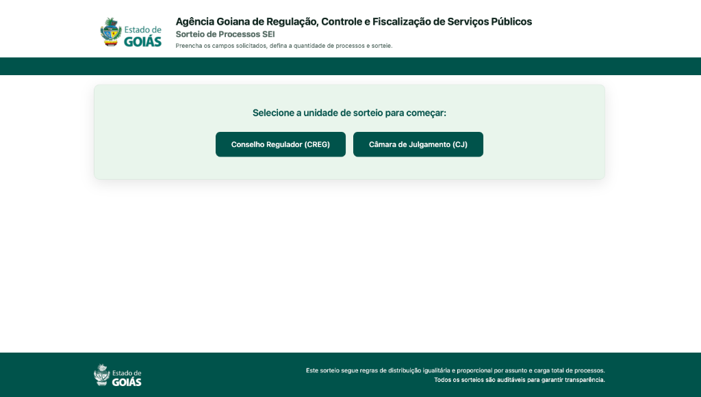
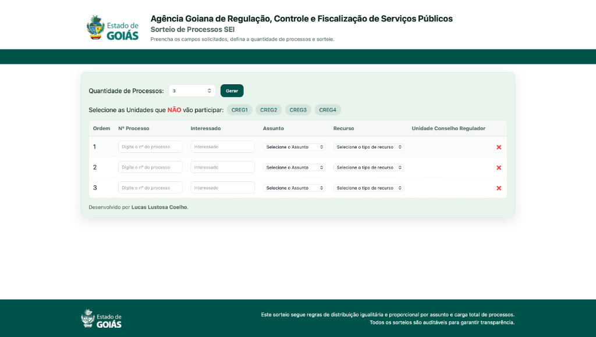

# Sorteador de Processos SEI


Aplicação web estática desenvolvida para auxiliar o **Secretário Executivo do Conselho Regulador** (modo CREG) e a **Secretária Executiva da Câmara de Julgamento** (modo CJ) da AGR na distribuição eletrônica e igualitária de processos do SEI entre suas respectivas unidades.

Acesse a aplicação online em: [https://thelustosa.github.io/sorteio-sei/](https://thelustosa.github.io/sorteio-sei/)

| Tela de Início | Interface do Sorteador |
| :---: | :---: |
|  |  |

---

## Auditoria e Transparência

Este repositório está público e totalmente aberto para auditoria dos sorteios. Caso surjam quaisquer dúvidas em relação à integridade da divisão dos processos, qualquer interessado pode inspecionar o código-fonte da lógica de distribuição para verificar a conformidade, impessoalidade e igualdade matemática das regras aplicadas.

O Termo de Entrega oficial do projeto para a Agência Goiana de Regulação (AGR) está disponível para consulta em: [SEI_93024891_Termo_de_Entrega_1.pdf](documentos/SEI_93024891_Termo_de_Entrega_1.pdf).

---

## Funcionalidades

- **Acesso Restrito por Login**: o sorteio só é liberado após autenticação com usuário e senha cadastrados, garantindo que apenas as secretarias executivas realizem distribuições. As senhas não ficam no código — são validadas pelo servidor do Supabase.
- **Geração Dinâmica de Linhas**: Permite definir a quantidade inicial de processos a serem cadastrados na tabela.
- **Inserção e Exclusão Flexíveis**: 
  - Adicione novas linhas a qualquer momento utilizando o botão **+ Adicionar Linha** sem perder os dados já preenchidos.
  - Exclua linhas geradas incorretamente de forma individual clicando no botão **×** no final da linha.
- **Distribuição Igualitária**:
  - Garante que cada unidade (CREG ou CJ) receba a mesma quantidade total de processos.
  - Realiza o balanceamento proporcional e cruzado de cada **Assunto** individualmente, evitando que uma unidade receba apenas um tipo de assunto de processo.
- **Exclusão de Unidades**: Seleção simples das unidades que NÃO vão participar da rodada de distribuição através de filtros de exclusão visual (pills).
- **Validação Completa**: Impede a realização do sorteio caso existam campos em branco na tabela ou números de processo repetidos, indicando as linhas em conflito.
- **Assunto Fixo na Câmara de Julgamento**: no modo CJ, todo processo é Auto de Infração — o campo já vem preenchido e travado, eliminando a possibilidade de erro.
- **Travamento de Recurso Inteligente** (CREG): Define automaticamente o campo de recurso como "Não se aplica" e o desabilita caso o assunto selecionado não seja "Auto de Infração".
- **Defesa no lugar de Recurso** (CJ): na Câmara de Julgamento a 6ª coluna registra se o autuado apresentou **Defesa** (Sim/Não) — é esse o dado que os julgados herdam do acervo. Recurso é conceito do Conselho Regulador e só aparece no modo CREG.
- **Exportação da Ata em Word**: geração automática da ata de distribuição em formato Word (`.doc`), nomeada dinamicamente (`Sorteio_CREG_18.08.2026.doc`).
- **Registro de Julgamentos**: página própria onde a secretaria abre uma pauta e preenche o voto e o status de cada processo julgado. Os processos chegam sozinhos das pautas publicadas pela AGR, e cada preenchimento guarda quem fez e quando.
- **Registro no Banco de Dados**: ao final do sorteio, os dados que antes iam para as planilhas são gravados no banco (Supabase/PostgreSQL), uma linha por processo — a Câmara de Julgamento no seu acervo (`acervo_cj`), o Conselho Regulador em `processos_sorteados`. Enquanto o banco não estiver configurado — ou se o envio falhar — o sistema baixa automaticamente um arquivo `.json` de backup com o sorteio completo, para reenvio posterior, de modo que nenhum sorteio se perca.

---

## Design e Cores

O visual foi adaptado com base na identidade visual institucional do portal do **Estado de Goiás**:
- **Paleta de Cores**: Uso do verde institucional (`#00534b`) como cor principal de realce e botões, fundo de tela branco, e painel interno em tom de verde menta claro (`#E9F5EC`).
- **Rodapé Institucional**: Banner verde com logotipo branco oficial e informações de integridade e auditoria do sorteio.

---

## Estrutura de Arquivos

- [`FLUXO-CJ.md`](FLUXO-CJ.md): **Fluxo completo da Câmara de Julgamento** — do sorteio ao julgamento registrado, com as regras, as tabelas, a API e o tratamento de falhas.
- `documentos/`: Pasta contendo o Termo de Entrega oficial do projeto.
- `schema.sql`: Script de criação das tabelas e das políticas de segurança (RLS) do banco.
- `migracao_cj.sql`: Migração dos processos da Câmara de Julgamento para o novo acervo.
- [`verificacao_cj.sql`](verificacao_cj.sql): Conferência de consistência dos dados da CJ — só lê, roda a qualquer momento.
- [`correcoes_cj.sql`](correcoes_cj.sql): Correções pontuais do histórico importado da planilha.
- `dados/importar_planilha.py`: Converte a planilha histórica da CJ em SQL de importação.
- `sincronizacao/`: Serviço que alimenta os julgados a partir das pautas publicadas pela AGR.
- `tests/`: Testes da Câmara de Julgamento e da sincronização, contra um Postgres real.
- `CONFIGURAR-SUPABASE.md`: Guia passo a passo de configuração do banco de dados.
- `index.html` / `index.js`: Sorteio de processos — estrutura da página e lógica da distribuição.
- `julgados.html` / `julgados.js`: Registro do voto e do status dos processos julgados.
- `supabase.js`: Configuração e login do banco, compartilhados pelas duas páginas.
- `index.css`: Arquivo de estilização CSS contendo o design visual do sistema.

---

## Configuração do Banco de Dados

O passo a passo completo está em **[CONFIGURAR-SUPABASE.md](CONFIGURAR-SUPABASE.md)** — criação do projeto, execução do `schema.sql`, credenciais, teste e solução de problemas. Em resumo: crie um projeto gratuito no [Supabase](https://supabase.com), rode o [schema.sql](schema.sql) e preencha as constantes `SUPABASE_URL` e `SUPABASE_KEY` no `supabase.js`.

A chave publicável é pública por natureza e pode ficar no código: ela identifica o projeto, não autoriza operações. A proteção dos dados vem das políticas de RLS do `schema.sql`, que exigem **usuário autenticado** e dão a cada tabela o mínimo: o sorteio só **insere** (nenhum sorteio já gravado pode ser lido, alterado ou apagado pelo navegador), `julgados_cj` só é **lida** pela página de registro, e `pautas_cj` não é nem uma coisa nem outra. Não existe política de `UPDATE` ou `DELETE` em tabela nenhuma. É o que permite manter o código-fonte totalmente aberto para auditoria.

---

## Câmara de Julgamento: acervo e julgados

> O passo a passo completo, com diagramas, está em **[FLUXO-CJ.md](FLUXO-CJ.md)**.

A CJ deixou de compartilhar a tabela `processos_sorteados` com o Conselho Regulador e passou a ter as duas tabelas que a secretaria já usava na planilha:

- **`acervo_cj`** — uma linha por **distribuição** de um processo a um relator. Um processo redistribuído aparece mais de uma vez, com datas e relatores diferentes. É aqui que o sorteio da CJ grava (a cadeira sorteada, `CJ1`..`CJ5`, é o relator do processo).
- **`julgados_cj`** — uma linha por processo levado a uma **sessão de julgamento**, ligada ao registro do acervo por `acervo_id`.

O que a planilha resolvia com fórmulas agora é regra do banco. Ao registrar um julgamento basta informar o processo e a data da sessão — um gatilho localiza o processo no acervo e preenche **relator**, **defesa** e **data de distribuição**, e o banco calcula **`dias_dt`** (dias entre a distribuição e a sessão) e **`periodo_dt`** (o trimestre, `1T26`). Valor informado à mão nunca é sobrescrito; gravar `null` num campo derivado pede a rederivação.

Quando o processo foi redistribuído, vale a distribuição vigente **na data da sessão** — o relator que de fato levou o processo à mesa. Os campos derivados são gravados como cópia, e não lidos por referência, para que uma redistribuição posterior não reescreva um julgamento já ocorrido.

Ordem de execução no SQL Editor do Supabase:

1. `schema.sql` — cria as tabelas, o gatilho e as políticas;
2. `migracao_cj.sql` — move os sorteios CJ de `processos_sorteados` para `acervo_cj` (confere antes de apagar; a tabela antiga passa a aceitar só CREG);
3. `dados/acervo_cj.sql` e `dados/julgados_cj.sql` — histórico da planilha, nessa ordem. São gerados por `python dados/importar_planilha.py "Câmara de Julgamento - REG.xlsx"` e ficam fora do Git: trazem nome de interessado pessoa física e este repositório é público.

Os três passos são idempotentes: rodar de novo não duplica nada.

O Conselho Regulador continua em `processos_sorteados` até ganhar o mesmo par de tabelas (`acervo_creg` e `julgados_creg`).

### Registro do voto e do status

Os julgados que chegam da AGR vêm **sem voto e sem status** — as duas coisas são decisão da sessão e só existem depois dela. Quem preenche é a secretaria, em **[julgados.html](julgados.html)**:

```text
lista das pautas com pendência → clica no número da reunião
  → tabela dos processos daquela pauta, com Voto e Status
  → Salvar
```

Voto (`Manter`, `Anular`, `Vista`) e Status (`Julgado`, `Retornou`, `Retirado`, `Vista`) são independentes: processo retirado de pauta fica com status e sem voto, e continua aparecendo como pendente enquanto faltar algum dos dois. Só as linhas em que o funcionário mexeu são enviadas.

Isso abriu, pela primeira vez, **leitura** do banco para o navegador — só da tabela `julgados_cj`, e só para usuário autenticado. A escrita continua fechada: não existe política de `UPDATE` em nenhuma tabela. Gravar passa pela função `registrar_votos`, que aceita apenas voto e status, recusa rótulo fora da lista e anota em `atualizado_por` / `atualizado_em` quem preencheu e quando.

E a função não encosta no histórico: linha que veio da planilha, já com voto e status, é imutável por essa porta. Só é editável o que ainda está pendente ou o que a própria página gravou antes — para corrigir um erro de digitação.

### Sincronização automática com as pautas da AGR

A partir daqui a planilha não é mais necessária para atualizar os julgados: a fonte é a publicação oficial em [pautas das reuniões](https://goias.gov.br/agr/pautas-das-reunioes-2026/).

```text
listagem da AGR → reuniões ainda não processadas → baixa o PDF
  → extrai o texto → descarta o rodapé "Referência: Processo nº …"
  → extrai e normaliza os processos → insere em julgados_cj
  → o gatilho busca cada processo em acervo_cj e preenche o resto
  → registra o documento em pautas_cj
```

Onde isso roda: **GitHub Actions**, não no site. O site é estático no Pages e o navegador nem conseguiria consultar `goias.gov.br`, que não libera CORS. O job roda toda sexta de manhã (as sessões são às quintas) e pode ser disparado à mão em **Actions → Sincronizar Julgados CJ → Run workflow**, com a opção `simular` para ver o resultado sem gravar nada. O log de cada rodada fica na aba Actions, o que mantém a sincronização tão auditável quanto o resto do projeto.

Para funcionar, cadastre em **Settings → Secrets and variables → Actions** o segredo `SUPABASE_DB_URL` com a connection string do banco.

Também dá para rodar da sua máquina:

```bash
python sincronizacao/sincronizar.py --simular --dsn "postgresql://..."
```

Como o parser identifica um processo: número SEI de **15 dígitos precedido de `Processo nº`**. Conferido em 10 pautas de datas diferentes — 190 números de 15 dígitos, todos com o rótulo, e nenhum outro número do documento chega perto (auto de infração tem 5 dígitos, código verificador do SEI tem 8). O rodapé é retirado **antes** da busca, por contexto e nunca por lista de números proibidos: `Referência: Processo nº …` aponta para o processo do próprio documento no SEI e ele muda a cada ano. Se um dia aparecer um número de 15 dígitos sem o rótulo, a sincronização registra o aviso em vez de perdê-lo em silêncio.

Nada disso reimplementa a regra Acervo → Julgados: quem preenche relator, defesa e data de distribuição continua sendo o gatilho do banco. Processo que aparece na pauta e não está no acervo é gravado assim mesmo, sem inventar dado, e sai listado em `pautas_cj.processos_sem_acervo` para a secretaria completar o acervo.

Rodar duas vezes não duplica nada: `pautas_cj.url` barra o documento repetido e a chave `(num_processo, data_sessao)` de `julgados_cj` barra o processo repetido.

### Testes

```bash
python tests/test_cj.py "C:/caminho/Câmara de Julgamento - REG.xlsx"
```

Sobe um Postgres descartável no Docker (o mesmo motor do Supabase), aplica o schema e a migração, importa a planilha e confere que o banco reproduz as fórmulas — inclusive apagando os campos derivados de todas as 3.144 linhas de julgados e mandando o banco recalculá-las do zero. Sem a planilha à mão, os testes que dependem dela são pulados e o resto roda igual.

```bash
python tests/test_sincronizacao.py
```

Testa o parser e a sincronização contra fixtures reais (HTML da listagem, texto e PDF de pautas de datas diferentes) e contra o mesmo Postgres descartável, sem depender do site estar no ar. Com `--online` roda também um teste que consulta a AGR de verdade — serve para avisar quando o portal mudar de formato.

---

## Tecnologias Utilizadas

- **HTML5** (Semântico)
- **CSS3** (Flexbox, variáveis nativas e design responsivo)
- **JavaScript ES6+** (Lógica do sorteio e manipulação de DOM)
- **FileSaver.js** (Biblioteca para controle e download dos arquivos gerados)
- **Supabase / PostgreSQL** (Banco de dados dos sorteios, acessado via API REST com a Fetch API)
