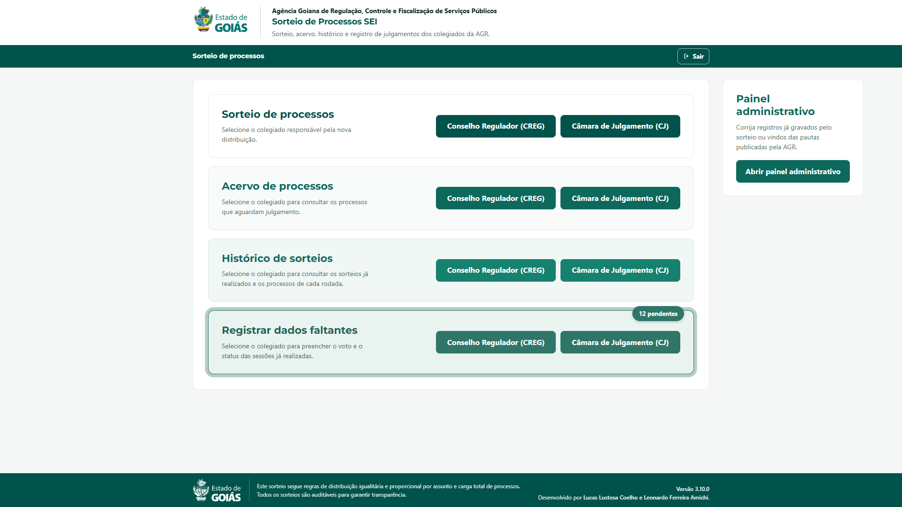
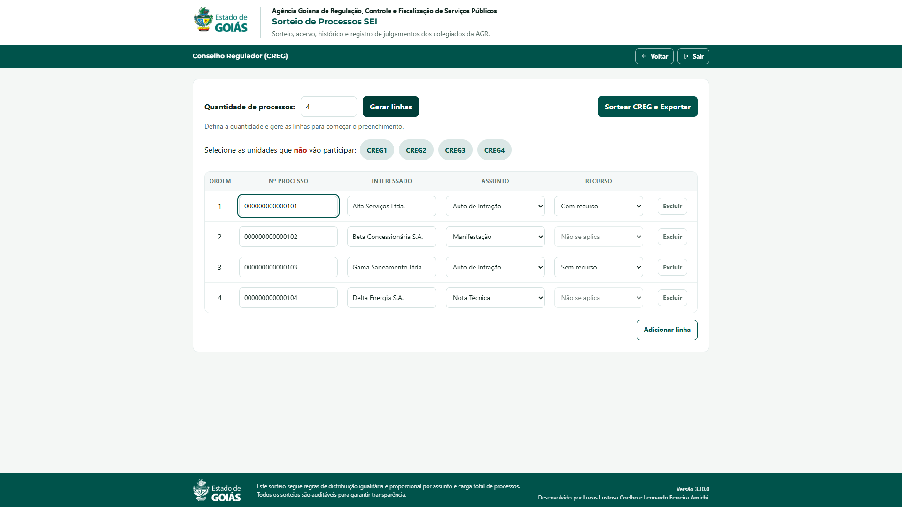

# Sorteador de Processos SEI


Aplicação web estática desenvolvida para auxiliar o **Secretário Executivo do Conselho Regulador** (modo CREG) e a **Secretária Executiva da Câmara de Julgamento** (modo CJ) da AGR na distribuição eletrônica e igualitária de processos do SEI entre suas respectivas unidades.

Acesse a aplicação online em: [https://thelustosa.github.io/sorteio-sei/](https://thelustosa.github.io/sorteio-sei/)

| Tela de Início | Interface do Sorteador |
| :---: | :---: |
|  |  |

---

## Auditoria e Transparência

Este repositório está público e totalmente aberto para auditoria dos sorteios. Caso surjam quaisquer dúvidas em relação à integridade da divisão dos processos, qualquer interessado pode inspecionar o código-fonte da lógica de distribuição para verificar a conformidade, impessoalidade e igualdade matemática das regras aplicadas.

O Termo de Entrega oficial do projeto para a Agência Goiana de Regulação (AGR) está disponível para consulta em: [SEI_93024891_Termo_de_Entrega_1.pdf](documentos/SEI_93024891_Termo_de_Entrega_1.pdf).

---

## Funcionalidades

- **Acesso Restrito por Login**: o sorteio só é liberado após autenticação com usuário e senha cadastrados, garantindo que apenas as secretarias executivas realizem distribuições. As senhas não ficam no código — são validadas pelo servidor do Supabase.
- **Geração Dinâmica de Linhas**: Permite definir a quantidade inicial de processos a serem cadastrados na tabela.
- **Inserção e Exclusão Flexíveis**: 
  - Adicione novas linhas a qualquer momento utilizando o botão **+ Adicionar Linha** sem perder os dados já preenchidos.
  - Exclua linhas geradas incorretamente de forma individual clicando no botão **×** no final da linha.
- **Distribuição Igualitária**:
  - Garante que cada unidade (CREG ou CJ) receba a mesma quantidade total de processos.
  - Realiza o balanceamento proporcional e cruzado de cada **Assunto** individualmente, evitando que uma unidade receba apenas um tipo de assunto de processo.
- **Exclusão de Unidades**: Seleção simples das unidades que NÃO vão participar da rodada de distribuição através de filtros de exclusão visual (pills).
- **Validação Completa**: Impede a realização do sorteio caso existam campos em branco na tabela ou números de processo repetidos, indicando as linhas em conflito.
- **Assunto Fixo na Câmara de Julgamento**: no modo CJ, todo processo é Auto de Infração — o campo já vem preenchido e travado, eliminando a possibilidade de erro.
- **Travamento de Recurso Inteligente** (CREG): Define automaticamente o campo de recurso como "Não se aplica" e o desabilita caso o assunto selecionado não seja "Auto de Infração".
- **Defesa no lugar de Recurso** (CJ): na Câmara de Julgamento a 6ª coluna registra se o autuado apresentou **Defesa** (Sim/Não) — é esse o dado que os julgados herdam do acervo. Recurso é conceito do Conselho Regulador e só aparece no modo CREG.
- **Exportação da Ata em Word**: geração automática da ata de distribuição em formato Word (`.doc`), nomeada dinamicamente (`Sorteio_CREG_18.08.2026.doc`). A ata traz as mesmas colunas da tela — ordem, processo, assunto, recurso (ou defesa, na CJ) e unidade sorteada — para que quem lê o documento consiga conferir a repartição por assunto sem abrir o sistema.
- **Registro de Julgamentos**: página própria onde a secretaria abre uma pauta e preenche o voto e o status de cada processo julgado. Os processos chegam sozinhos das pautas publicadas pela AGR, e cada preenchimento guarda quem fez e quando.
- **Registro no Banco de Dados**: ao final do sorteio, os dados que antes iam para as planilhas são gravados no banco (Supabase/PostgreSQL), uma linha por processo — a Câmara de Julgamento no seu acervo (`acervo_cj`), o Conselho Regulador em `processos_sorteados`. Enquanto o banco não estiver configurado — ou se o envio falhar — o sistema oferece um botão para baixar o sorteio completo em `.json`, sem depender de downloads automáticos bloqueados pelo navegador.

---

## Design e Cores

O visual foi adaptado com base na identidade visual institucional do portal do **Estado de Goiás**:
- **Paleta de Cores**: Uso do verde institucional (`#00534b`) como cor principal de realce e botões, fundo de tela branco, e painel interno em tom de verde menta claro (`#E9F5EC`).
- **Rodapé Institucional**: Banner verde com logotipo branco oficial e informações de integridade e auditoria do sorteio.
- **Tipografia**: títulos em **Montserrat**, sob a [SIL Open Font License 1.1](assets/fonts/OFL.txt), que permite uso, modificação e redistribuição. Ela substituiu a Gotham, que é comercial: como este repositório é público e está sob licença MIT, versionar o arquivo da fonte equivalia a redistribuí-la sem direito. Os dois arquivos `.woff2` cobrem os subconjuntos `latin` e `latin-ext`, que é o que o português usa.

---

## Estrutura de Arquivos

As três páginas ficam na raiz porque é de lá que o GitHub Pages serve o site —
`index.html` é a porta de entrada e `404.html` é o que o Pages procura quando o
endereço não existe. Todo o resto está agrupado por natureza.

```text
├── index.html              sorteio de processos (entrada do site)
├── julgados.html           registro do voto e do status
├── 404.html                página de endereço inexistente
│
├── assets/
│   ├── css/index.css       fonte legível do design de todas as páginas
│   ├── css/index.min.css   versão otimizada servida pelo site
│   ├── js/
│   │   ├── bootstrap.js    carrega cada área somente depois da autenticação
│   │   ├── index.js        fonte da lógica do sorteio e da ata
│   │   ├── julgados.js     fonte do registro de julgamentos
│   │   ├── supabase.js     configuração, login e chamadas — usado pelas duas páginas
│   │   └── *.min.js        versões otimizadas servidas pelo site
│   ├── fonts/              Montserrat em .woff2 e a licença OFL
│   └── img/                logotipos, favicon e as capturas de tela do README
│
├── sw.js                   cache versionado dos assets estáticos
├── sql/                    tudo que roda no SQL Editor do Supabase
│   ├── schema.sql          tabelas, gatilho, função de registro e RLS
│   ├── verificacao_cj.sql  conferência de consistência — só lê
│   ├── rederivar_cj.sql    religa ao acervo os julgados que entraram sem ele
│   ├── backup_cj.sql       copia as tabelas da CJ para o schema backup_cj
│   └── restaurar_cj.sql    a volta do backup
│
├── supabase/migrations/    histórico aplicado ao projeto hospedado
├── sincronizacao/          job que lê as pautas da AGR (roda no GitHub Actions)
├── dados/                  conversão da planilha histórica em SQL
├── documentos/             Termo de Entrega oficial do projeto
└── tests/                  suítes automatizadas e dependências de teste
```

Documentação: este README, mais o [`FLUXO-CJ.md`](FLUXO-CJ.md) — o fluxo completo
da Câmara de Julgamento, do sorteio ao julgamento registrado, com as regras, as
tabelas, a API e o tratamento de falhas.

O GitHub Pages define um cache curto para os arquivos publicados e não permite
configurar cabeçalhos por repositório. Por isso, o `sw.js` guarda apenas CSS,
JavaScript, fontes e imagens do próprio site; HTML e dados do Supabase nunca
entram nesse cache. Ao alterar um asset, atualize a mesma versão em
`ASSET_VERSION` (`assets/js/supabase.js`), nos parâmetros `?v=` dos HTMLs e em
`CACHE_NAME` (`sw.js`), gere novamente os arquivos `.min.*` e rode os testes.

```powershell
npx --yes esbuild@0.28.2 assets/css/index.css --minify --outfile=assets/css/index.min.css
npx --yes esbuild@0.28.2 assets/js/supabase.js --minify-syntax --minify-whitespace --outfile=assets/js/supabase.min.js
npx --yes esbuild@0.28.2 assets/js/bootstrap.js --minify-syntax --minify-whitespace --outfile=assets/js/bootstrap.min.js
npx --yes esbuild@0.28.2 assets/js/index.js --minify-syntax --minify-whitespace --outfile=assets/js/index.min.js
npx --yes esbuild@0.28.2 assets/js/julgados.js --minify-syntax --minify-whitespace --outfile=assets/js/julgados.min.js
```

---

## Configuração do Banco de Dados

Crie um projeto gratuito no [Supabase](https://supabase.com), rode o [schema.sql](sql/schema.sql) no SQL Editor e preencha as constantes `SUPABASE_URL` e `SUPABASE_KEY` no [supabase.js](assets/js/supabase.js). O `sql/schema.sql` cria as tabelas, o gatilho, a função de registro de votos e as políticas de segurança — e pode ser reaplicado sem duplicar registros. Ele também garante o marco fixo da sincronização em 18/06/2026.

Antes de reaplicá-lo numa base CREG já populada, rode
[`sql/verificacao_cj.sql`](sql/verificacao_cj.sql). Se houver “Distribuição CREG
repetida”, decida qual registro conservar: o índice único do schema falha com
segurança, sem apagar ou escolher dados automaticamente.

Sorteios CREG aceitam somente número SEI com 15 dígitos e a constraint fica
validada. Se uma base antiga ainda tiver número fora do padrão, corrija-o pela
fonte oficial antes de reaplicar o schema; a validação falha sem completar ou
apagar números por inferência.

Depois, em **Authentication → Users**, cadastre quem vai usar o sistema; e em **Authentication → Providers → Email**, mantenha **desativado** o "Enable sign ups", senão qualquer visitante criaria a própria conta.

Se o projeto migrar para um plano Pro ou superior, ative também **Prevent use
of leaked passwords**; o recurso não está disponível no plano Free.

### Prevenção de Inatividade (Keep-Alive do Supabase)

No plano gratuito, o Supabase pausa automaticamente projetos que ficam 7 dias sem requisições. Para evitar a hibernação sem custos, o `sql/schema.sql` inclui a função `public.ping()`, que é leve, segura (não lê nem altera dados) e marcada como `STABLE` para responder a requisições `HEAD` e `GET` anônimas com `200 OK`.

Para configurar no **UptimeRobot** (plano gratuito com método `HEAD`) ou no **cron-job.org**:
- **Tipo de Monitor:** `HTTP(s)`
- **URL:**
  ```text
  https://<SEU_PROJECT_REF>.supabase.co/rest/v1/rpc/ping?apikey=<SUA_PUBLISHABLE_KEY>
  ```
- **Intervalo:** A cada 5 a 15 minutos (ou diário via cron).

A chave publicável é pública por natureza e pode ficar no código: ela identifica o projeto, não autoriza operações. A proteção dos dados vem das políticas de RLS do `schema.sql`, que exigem **usuário autenticado** e dão a cada tabela o mínimo: o sorteio só **insere** (nenhum sorteio já gravado pode ser lido, alterado ou apagado pelo navegador), `julgados_cj` só é **lida** pela página de registro, e `pautas_cj` não é nem uma coisa nem outra. Não existe política de `UPDATE` ou `DELETE` em tabela nenhuma. É o que permite manter o código-fonte totalmente aberto para auditoria.

---

## Câmara de Julgamento: acervo e julgados

> O passo a passo completo, com diagramas, está em **[FLUXO-CJ.md](FLUXO-CJ.md)**.

A CJ deixou de compartilhar a tabela `processos_sorteados` com o Conselho Regulador e passou a ter as duas tabelas que a secretaria já usava na planilha:

- **`acervo_cj`** — uma linha por **distribuição** de um processo a um relator. Um processo redistribuído aparece mais de uma vez, com datas e relatores diferentes. É aqui que o sorteio da CJ grava (a cadeira sorteada, `CJ1`..`CJ5`, é o relator do processo).
- **`julgados_cj`** — uma linha por processo levado a uma **sessão de julgamento**, ligada ao registro do acervo por `acervo_id`.

O que a planilha resolvia com fórmulas agora é regra do banco. Ao registrar um julgamento basta informar o processo e a data da sessão — um gatilho localiza o processo no acervo e preenche **relator**, **defesa** e **data de distribuição**, e o banco calcula **`dias_dt`** (dias entre a distribuição e a sessão) e **`periodo_dt`** (o trimestre, `1T26`). Valor informado à mão nunca é sobrescrito; gravar `null` num campo derivado pede a rederivação.

Quando uma data de distribuição é informada à mão, o vínculo só é criado se
existir no acervo aquela distribuição exata. Sem correspondência, o julgado fica
órfão para revisão em vez de apontar para uma distribuição de outra data.

Quando o processo foi redistribuído, vale a distribuição vigente **na data da sessão** — o relator que de fato levou o processo à mesa. Os campos derivados são gravados como cópia, e não lidos por referência, para que uma redistribuição posterior não reescreva um julgamento já ocorrido.

Ordem de execução no SQL Editor do Supabase:

1. `sql/schema.sql` — cria as tabelas, o gatilho e as políticas;
2. `dados/acervo_cj.sql` e `dados/julgados_cj.sql` — **só num banco novo**, para carregar o histórico da planilha. Gerados por `python dados/importar_planilha.py "Câmara de Julgamento - REG.xlsx"`, ficam fora do Git por precaução: são dados administrativos em volume, e este repositório é público.

Os dois passos são idempotentes: rodar de novo não duplica nada. No banco em produção o histórico já foi carregado e depois arquivado — ver abaixo.

O Conselho Regulador continua em `processos_sorteados` até ganhar o mesmo par de tabelas (`acervo_creg` e `julgados_creg`).

### Registro do voto e do status

Os julgados que chegam da AGR vêm **sem voto e sem status** — as duas coisas são decisão da sessão e só existem depois dela. Quem preenche é a secretaria, em **[julgados.html](julgados.html)**:

```text
lista das pautas com pendência → clica no número da reunião
  → tabela dos processos daquela pauta, com Voto e Status
  → Salvar
```

Voto (`Manter`, `Anular`, `Vista`) e Status (`Julgado`, `Retornou`, `Retirado`, `Vista`) são independentes: processo retirado de pauta fica com status e sem voto, e continua aparecendo como pendente enquanto faltar algum dos dois. Só as linhas em que o funcionário mexeu são enviadas.

Isso abriu, pela primeira vez, **leitura** do banco para o navegador — só da tabela `julgados_cj`, e só para usuário autenticado. A escrita continua fechada: não existe política de `UPDATE` em nenhuma tabela. Gravar passa pela função `registrar_votos`, que aceita apenas voto e status, recusa rótulo fora da lista e anota em `atualizado_por` / `atualizado_em` quem preencheu e quando.

E a função não encosta no histórico: linha que veio da planilha, já com voto e status, é imutável por essa porta. Só é editável o que ainda está pendente ou o que a própria página gravou antes — para corrigir um erro de digitação.

### Sincronização automática com as pautas da AGR

A partir daqui a planilha não é mais necessária para atualizar os julgados: a fonte é a publicação oficial em [pautas das reuniões](https://goias.gov.br/agr/pautas-das-reunioes-2026/).

```text
listagem da AGR → reuniões ainda não processadas → baixa o PDF
  → extrai o texto → descarta o rodapé "Referência: Processo nº …"
  → extrai e normaliza os processos → insere em julgados_cj
  → o gatilho busca cada processo em acervo_cj e preenche o resto
  → registra o documento em pautas_cj
```

Onde isso roda: **GitHub Actions**, não no site. O site é estático no Pages e o navegador nem conseguiria consultar `goias.gov.br`, que não libera CORS. O job roda toda sexta de manhã (as sessões são às quintas) e pode ser disparado à mão em **Actions → Sincronizar Julgados CJ → Run workflow**, com a opção `simular` para ver o resultado sem gravar nada. O log de cada rodada fica na aba Actions, o que mantém a sincronização tão auditável quanto o resto do projeto.

Para funcionar, cadastre em **Settings → Secrets and variables → Actions** o segredo `SUPABASE_DB_URL` com a connection string do banco.

Também dá para rodar da sua máquina:

```bash
python sincronizacao/sincronizar.py --simular --dsn "postgresql://..."
```

Como o parser identifica um processo: número SEI de **15 dígitos precedido de `Processo nº`**. Conferido em 10 pautas de datas diferentes — 190 números de 15 dígitos, todos com o rótulo, e nenhum outro número do documento chega perto (auto de infração tem 5 dígitos, código verificador do SEI tem 8). O rodapé é retirado **antes** da busca, por contexto e nunca por lista de números proibidos: `Referência: Processo nº …` aponta para o processo do próprio documento no SEI e ele muda a cada ano. Se um dia aparecer um número de 15 dígitos sem o rótulo, a sincronização registra o aviso em vez de perdê-lo em silêncio.

Nada disso reimplementa a regra Acervo → Julgados: quem preenche relator, defesa e data de distribuição continua sendo o gatilho do banco. Processo que aparece na pauta e não está no acervo é gravado assim mesmo, sem inventar dado, e sai listado em `pautas_cj.processos_sem_acervo` para a secretaria completar o acervo.

Rodar duas vezes não duplica nada: `pautas_cj.url` barra o documento repetido e a chave `(num_processo, data_sessao)` de `julgados_cj` barra o processo repetido. O marco de início é fixo e a rodada automática consulta todos os anos desde ele, então um PDF que falhou volta mesmo após a virada do ano; uma versão corrigida com URL nova também é processada.

### Backup e restauração

Em 19/08/2026 a série de julgados foi reiniciada: o histórico da planilha saiu
das tabelas de produção e ficou guardado no schema `backup_cj`, dentro do mesmo
banco. Produção passou a ter só os processos ainda não julgados, e os
julgamentos passaram a ser registrados pelo sistema a partir dali.

Dois dias depois, uma carga de recuperação repôs o período que a planilha não
alcançava — de 25/06 a 20/08/2026 — lendo as atas de sorteio publicadas no SEI e
as pautas publicadas pela AGR: 157 distribuições e 151 julgados. O script era de
execução única e não ficou no repositório; o que ele decidiu, e onde deixou o
banco, está em [`FLUXO-CJ.md`](FLUXO-CJ.md).

- [`backup_cj.sql`](sql/backup_cj.sql) copia `acervo_cj`, `julgados_cj` e
  `pautas_cj` para o schema `backup_cj`. Rode antes de qualquer alteração de
  risco.
- [`restaurar_cj.sql`](sql/restaurar_cj.sql) é a volta: devolve as três tabelas ao
  estado do backup.

Cada um é **um único comando** — um bloco `do $$ … $$`. No SQL Editor do
Supabase os comandos passam por um pooler em modo transação e podem cair em
conexões diferentes, então `begin;…commit;` não segura nada. Num bloco único, ou
tudo passa ou nada é gravado.

Para uma cópia **fora** do Supabase, pegue a connection string em
*Project Settings → Database* e rode:

```bash
docker run --rm -v "$PWD:/saida" postgres:15-alpine pg_dump "SUA_CONNECTION_STRING" -Fc -f /saida/sorteio-sei-backup.dump
```

### Testes

Instale uma vez as dependências usadas pelas suítes Python:

```bash
python -m pip install -r tests/requirements.txt
```

```bash
python tests/test_cj.py "C:/caminho/Câmara de Julgamento - REG.xlsx"
```

Sobe um Postgres descartável no Docker (o mesmo motor do Supabase), aplica o schema e a migração, importa a planilha e confere que o banco reproduz as fórmulas — inclusive apagando os campos derivados de todas as 3.144 linhas de julgados e mandando o banco recalculá-las do zero. Sem a planilha à mão, os testes que dependem dela são pulados e o resto roda igual.

```bash
python tests/test_sincronizacao.py
```

Testa o parser e a sincronização contra fixtures reais (HTML da listagem, texto e PDF de pautas de datas diferentes) e contra o mesmo Postgres descartável, sem depender do site estar no ar. Com `--online` roda também um teste que consulta a AGR de verdade — serve para avisar quando o portal mudar de formato.

```bash
node tests/test_sorteio.mjs
node --test tests/test_frontend.mjs
node tests/test_assets.mjs
```

Não precisam de Docker nem de banco: exercitam o embaralhamento auditável, os
fluxos do frontend e a coerência entre assets minificados, carregamento lazy e
versão do cache.

O workflow [`.github/workflows/ci.yml`](.github/workflows/ci.yml) repete essas
verificações em todo push e pull request, executa as suítes PostgreSQL e rejeita
fontes cujos arquivos `.min.*` não tenham sido regenerados com a versão fixada
do esbuild.

---

## Tecnologias Utilizadas

- **HTML5** (Semântico)
- **CSS3** (Flexbox, variáveis nativas e design responsivo)
- **JavaScript ES6+** (Lógica do sorteio e manipulação de DOM)
- **Sem dependências de terceiros no navegador** (a ata em Word e o backup .json são gerados com `Blob` e `URL.createObjectURL`, da própria plataforma)
- **Supabase / PostgreSQL** (Banco de dados dos sorteios, acessado via API REST com a Fetch API)
